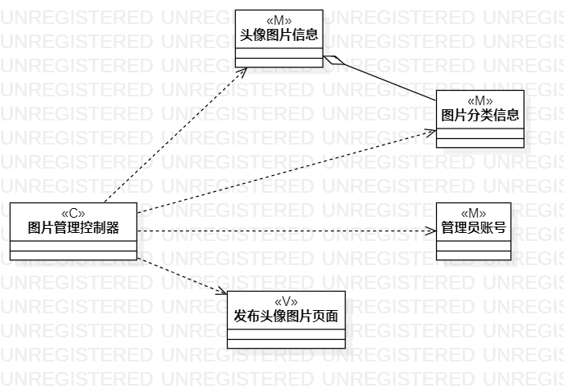
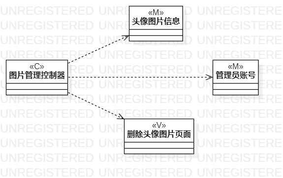
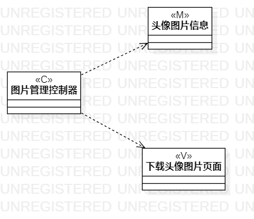

# 实验四五：类建模

## 一、实验目标

1. 掌握类建模；
2. 了解MVC或你熟悉的设计模式；
3. 掌握类图的画法(Class Diagram)。

## 二、实验内容

1. 基于MVC模式设计类；
2. 设计类的关系；
3. 画出类图。

## 三、实验步骤

1. 理解类图的符号意义及其用法；
2. 在StarUML创建Class Diagram；
3. 添加Class；
4. 根据用例规约设置好Class的name和stereotype；
5. 用依赖线和聚合线把Class建立起联系；
6. 思考类图的严谨性，修改用例规约和类图；
7. 调节符号之间的间距与比例，美化类图；
8. 重复2-7，完成全部类图；
9. 使用Git Bash提交实验报告。

## 四、实验结果

### 发布头像图片类图

需要管理员权限，但管理员登录是前置条件，这里逻辑没有涉及到。

### 删除头像图片类图

需要管理员权限，但管理员登录是前置条件，这里逻辑没有涉及到。

### 下载头像图片类图

app上下载图片，不用登录就可以进入。

