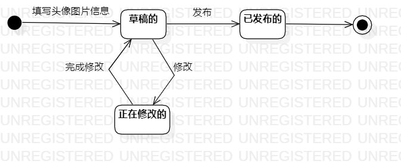

# 实验七：状态建模

## 一、实验目标

1. 掌握对象状态建模。

## 二、实验内容

1. 理解对象的概念；
2. 理解状态的概念；
3. 学习状态图的画法。

## 三、实验步骤

1. 找出关键对象：头像图片

2. 设计该对象的关键状态：
   - 草稿的
   - 正在修改的
   - 已发布的
3. 描述状态间的转变条件

## 四、实验结果

头像图片状态图：

头像图片删除了就删除了对应的数据，不标记已删除。

