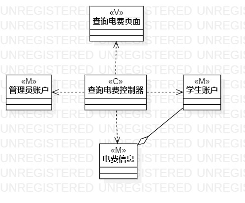
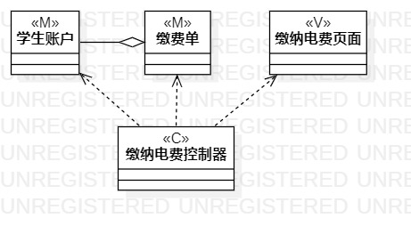

# 实验四、五 ： 类建模

## 一、实验目标

1. 掌握类建模方法
2. 了解MVC设计模式
3. 掌握类图的画法
4. 理解类的关系

## 二、实验内容

1. 学习类图概念
2. 了解类与类之间的基本关系
3. 根据用例规约进行类建模

## 三、实验步骤

1. 新建类图（Add Diagram -> Class Diagram）
2. 画出各个用例用到的类（Model、View、Controller）
3. 用线连接各个类表示它们之间的关系

## 四、实验结果

  
图1：查询电费的类图  

  
图2：缴纳电费的类图  
