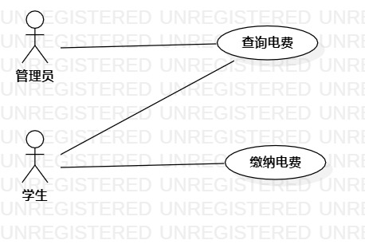

# 实验二：用例建模

## 1.实验目标

- 创建并完善选题
- 了解并掌握用例图画法
- 通过GitHub提交实验文档
  
## 2.实验内容

- 建立个人选题项目
- 根据个人选题绘制用例图
- 用Git操作提交实验

## 3.实验步骤
### 3.1确立系统功能(UseCase)

- 查询电费
- 缴纳电费

### 3.2确立系统扮演者(Actor)
- 管理员
- 学生

### 3.3建立之间的联系（Association）

## 4.实验结果

  
图1：用电管理系统的用例图

用例编号  | UC01 | 备注  
-|:-|-  
用例名称  | 查询电费  |   
前置条件  | 管理员或学生登录用电管理系统且账号与微信关联    | *可选*   
后置条件  |    | *可选*   
基本流程  | 1. 管理员或学生点击查询链接；  |*用例执行成功的步骤*    
~| 2. 系统显示查询页面；  |   
~| 3. 管理员或学生输入宿舍号，点击查询按钮；  |   
~| 4. 系统检查宿舍号真实存在，查询宿舍电费信息；  |   
~| 5. 系统显示需缴纳电费数额。  |  
扩展流程  | 4.1 系统检查发现宿舍号不存在，提示“宿舍号不存在”；  |*用例执行失败*    
~|  |

用例编号  | UC02 | 备注  
-|:-|-  
用例名称  | 缴纳电费  |   
前置条件  | 学生登录用电管理系统且账号与微信关联    | *可选*   
后置条件  |    | *可选*   
基本流程  | 1. 学生点击缴费链接；  |*用例执行成功的步骤*    
~| 2. 系统显示缴费页面；  |   
~| 3. 学生输入宿舍号和缴费金额，点击缴费按钮；  |   
~| 4. 系统检查宿舍号真实存在且金额正确，跳转至微信支付；  |
~| 5. 系统核对支付结果通过，跳转至缴费界面；  |
~| 6. 系统更新该宿舍电费情况，显示缴费成功信息。  |  
扩展流程  | 4.1 系统检查发现宿舍号不存在，提示“宿舍号不存在”；  |*用例执行失败*    
~| 4.2 系统检查发现缴费金额小于零，提示“金额不正确”。  |
~| 5.1 系统核对支付结果未通过，跳转至缴费界面，提示“支付失败”。  |
