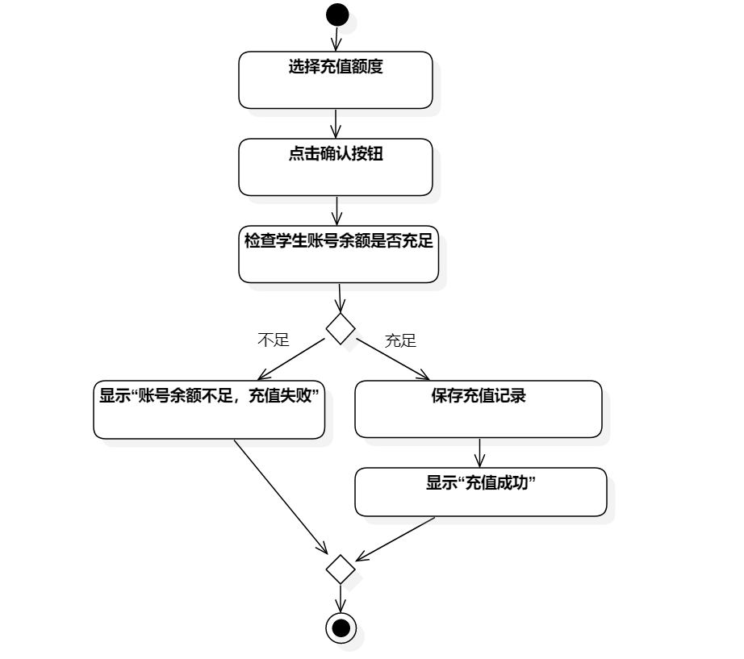
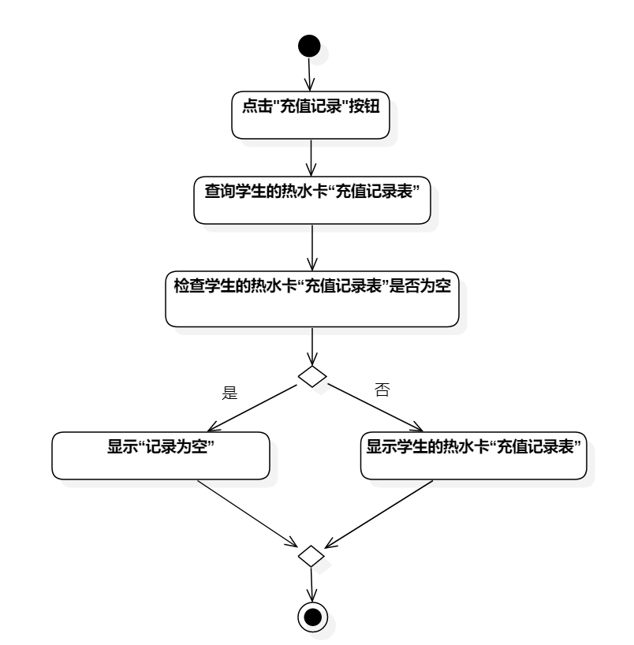

# 实验三：过程建模

## 一、实验目标
1. 掌握过程建模方法
2. 掌握活动图的画法(Activity Diagram)

## 二、实验内容
1. 用StartUML完成过程建模
2. 使用Markdown完成实验报告

## 三、实验步骤
1. 创建 热水卡充值 / 打印充值记录 的活动图
2. 添加Initial
3. 根据用例规约的基本流程添加活动图的Action
4. 根据用例规约的扩展流程添加活动图的Decision和Merge
4. 添加Final
5. 使用Control Flow连接各个图标
6. 调整图标的位置，使其尽可能美观

## 四、实验结果

图3-1 热水卡充值活动图

图3-2 打印充值记录活动图

