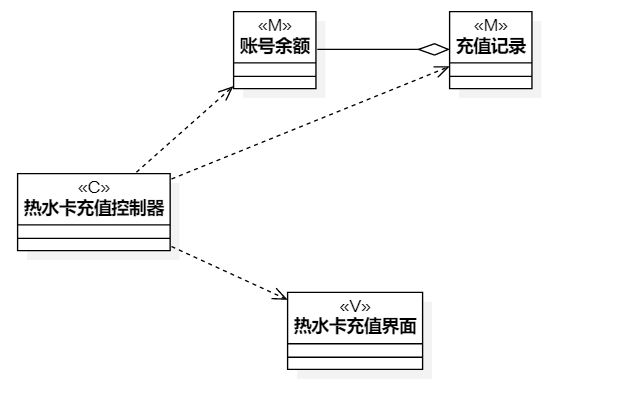
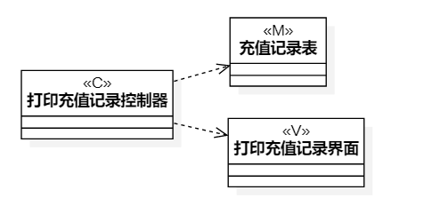

# 实验四&五 类建模与高级类建模  

## 一、实验目标
1. 掌握类建模方法
2. 了解MVC设计模式
3. 掌握类图的画法。（Class Diagram）

## 二、实验内容
1. 基于MVC模式设计类
2. 设计类的关系
3. 画出类图

## 三、实验步骤
1. 找出 热水卡充值 / 打印充值记录 用例规约中的类
2. 创建类图
3. 根据用例规约添加 model类
4. 根据用例规约添加 view类
5. 根据用例规划添加 controller类
6. 确定类之间的关系

## 四、实验结果

图1：热水卡充值类图

图2：打印充值记录类图