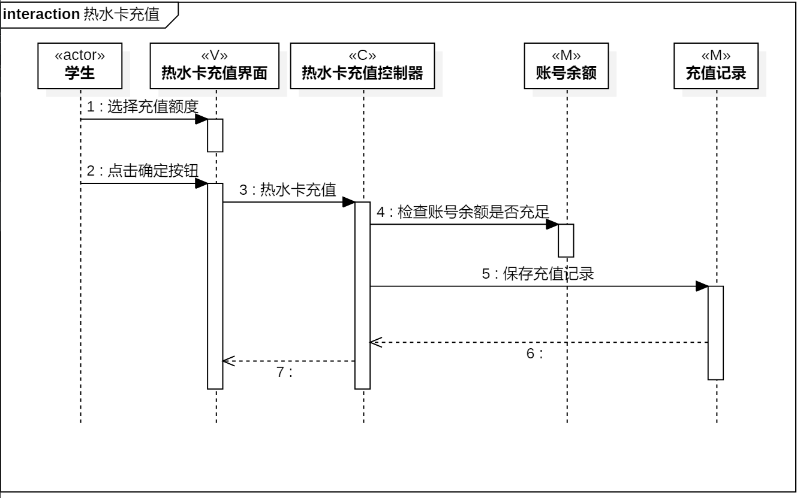
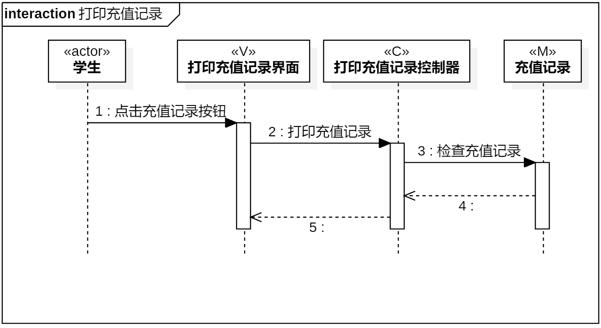

# 实验六 交互建模

## 一、实验目标
1. 理解系统交互；
2. 掌握UML顺序图的画法；
3. 掌握对象交互的定义与建模方法

## 二、实验内容
1. 根据用例模型和类模型，确定功能所涉及的系统对象；
 - 热水卡充值顺序图
 - 打印充值记录顺序图
2. 在顺序图上画出参与者（对象）
3. 在顺序图上画出消息（交互）

## 三、实验步骤
1. 在startUML中创建 热水卡充值 | 打印充值记录 顺序图
2. 从用例规约和类图中找到参与者，并添加Lifeline
3. 从活动图中找到操作步骤，添加参与者之间的Message和reply Message

## 四、实验结果

图1：热水卡充值顺序图

图2：打印充值记录顺序图