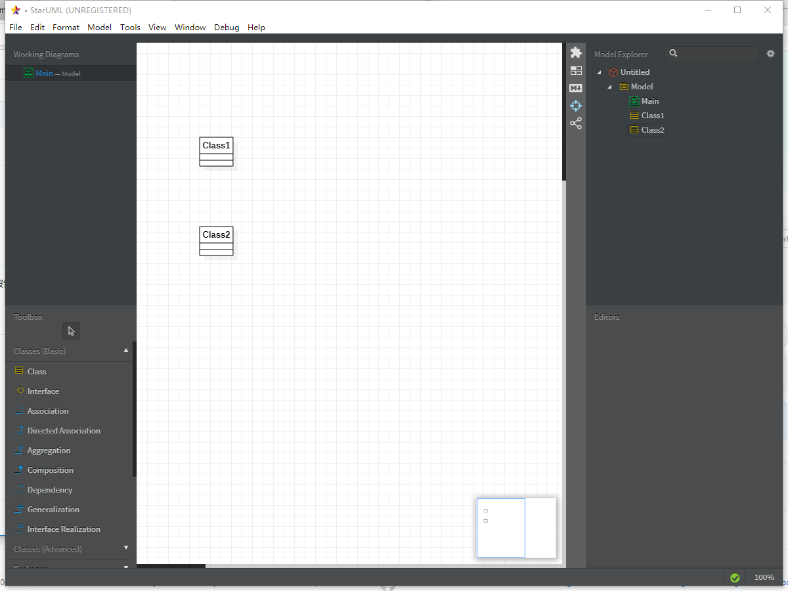

#实验一

##实验目标
#下载StarUML和Git
#注册git账号
#确认选题及其功能要求
#建立第一个UML模型图
#使用git上传本地使用文件
#在GitHup将git上的文件发送至老师账号

##实验内容

##选题标题：强化石镶嵌系统
 
##功能需求

#数据库建立，包括1个整数型的强化石数目，1个字符串型的强化石名字。

#功能1：选择强化石类型

#功能2：镶嵌强化石

#功能3：回收强化石
