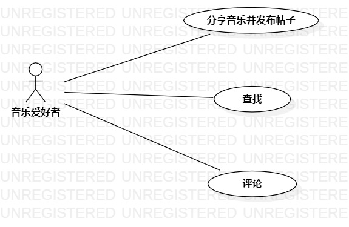

# 实验二

## 一、实验目标
- 使用Markdown编写报告
- 细化选题
- 学习使用StarUML用例建模

## 二、实验内容
- 创建用例图
- 编写实验报告文档
- 编写用例规约

## 三、实验步骤

1.  确定选题为音乐分享系统，功能如下：
- 发布帖子
- 查找帖子
- 评论他人帖子

2.  根据选题在StarUML上创建用例图（lab2.UseCaseDiagram1.jpg）
3.  确定参与者(Actor)：音乐爱好者
4.  确定用例(UserCase)：
- 发布帖子
- 查找帖子
- 评论
5.  建立Actor与UserCase之间的联系
6.  编写用例规约

## 四、实验结果

图1.音乐分享系统用例图

## 表1：分享音乐并发布帖子用例规约

用例编号  | UC01 | 备注  
-|:-|-  
用例名称  | 发布帖子  |   
前置条件  | 音乐爱好者登录进入系统   | *可选*   
后置条件  | 音乐爱好者进入帖子页面     | *可选*   
基本流程  | 1. 音乐爱好者选择歌曲并点击歌曲分享按钮；  |*用例执行成功的步骤*    
~| 2. 系统显示分享标题内容填写页面；  |   
~| 3. 音乐爱好者填写内容标题，点击确定按钮；  |   
~| 4. 系统检查内容标题均不为空且不包含敏感字；  |   
~| 5. 系统保存帖子信息；  |   
~| 6. 系统显示发布帖子页面。  |  
扩展流程  | 4.1 系统检查发现标题或内容缺失，显示“标题或内容不得为空！”。 |*用例执行失败*    
扩展流程  | 4.2 系统检查发现标题或内容包含敏感内容，提示用户“标题或内容包含敏感文字，请重新输入！”。 |*用例执行失败* 

## 表2：查找帖子用例规约

用例编号  | UC02 | 备注  
-|:-|-  
用例名称  | 查找帖子  |   
前置条件  |    | *可选*   
后置条件  | 音乐爱好者进入点击的帖子页面     | *可选*   
基本流程  | 1. 音乐爱好者输入内容点击查找按钮；  |*用例执行成功的步骤* 
~| 2. 系统检查输入内容不为空；  | 
~| 3. 系统查找包含输入关键字的帖子；  | 
~| 4. 系统显示包含关键字帖子的标题列表；  |    
扩展流程  | 2.1 搜索内容为空，提示“搜索内容不得为空！”|*用例执行失败*  

## 表3：评论用例规约

用例编号  | UC03 | 备注  
-|:-|-  
用例名称  | 评论  |   
前置条件  |  音乐爱好者登录进入系统  | *可选*   
后置条件  |   | *可选*   
基本流程  | 1. 音乐爱好者点击帖子链接；  |*用例执行成功的步骤*    
~| 2. 系统显示帖子页面；  |
~| 3. 音乐爱好者输入评论内容，点击评论；  |   
~| 4. 系统检查输入内容不为空且不包含敏感字；  |  
~| 5. 系统保存评论信息；  |  
~| 6. 系统刷新页面，显示含有最新评论的页面。  |     
扩展流程  | 4.1 系统检查发现输入内容含有敏感文字，提示用户“输入内容包含敏感文字，请重新输入！” |*用例执行失败*  
扩展流程  | 4.2 系统检查发现输入内容为空，提示用户“输入内容为空！” |*用例执行失败*  
