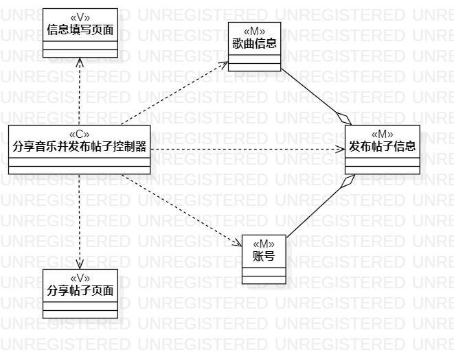
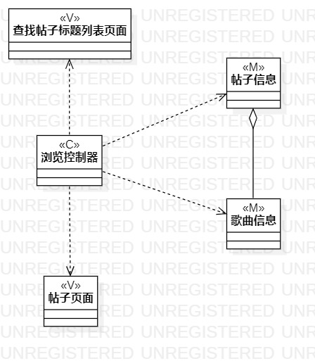
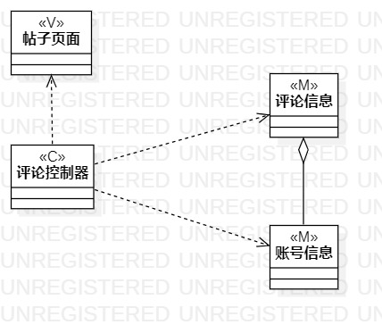

# 实验四五 类建模

## 一、实验目标

1. 掌握类建模方法；

2. 了解MVC设计模式；

3. 掌握类图的画法。

## 二、实验内容

1. 基于MVC模式设计类；

2. 设计类的关系；

3. 画出类图。

## 三、实验步骤

1. 确定设计模式,选择使用MVC模式;

2. 查看三个用例规约，每一个用例规约画一个类图；

3. 绘制类图，画出模型、视图和控制器；

4. 确定类之间的关系并进行连线；

## 四、实验结果

图一：发布帖子类图

图二：查找帖子类图

图三：评论类图

