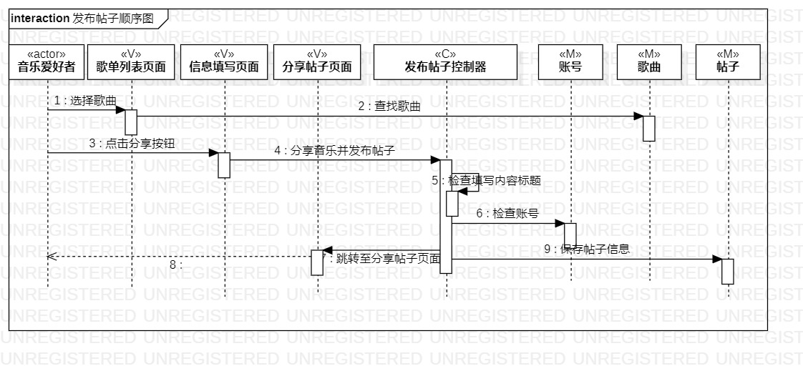
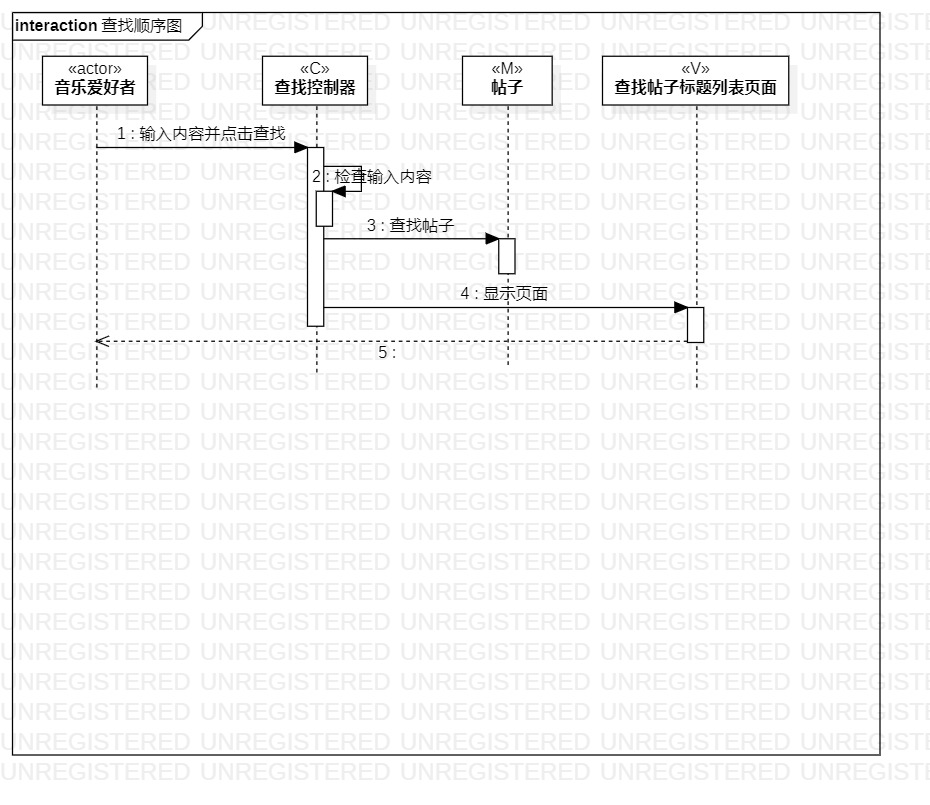
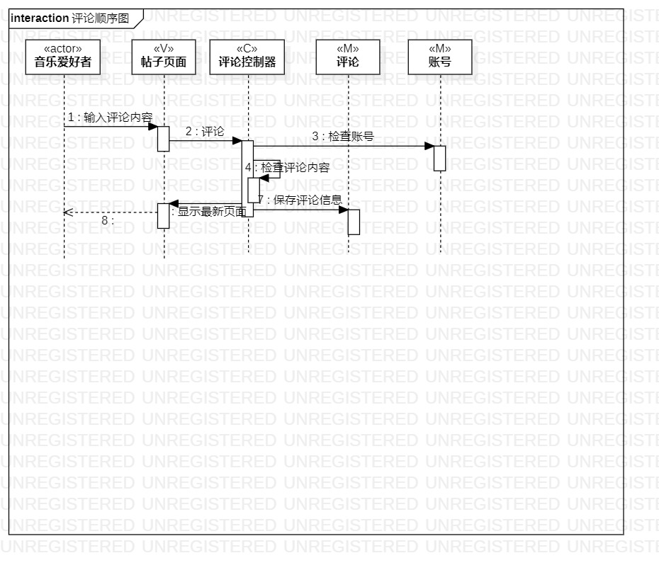

 # 实验六 交互建模

 ## 一、实验目标

 1. 理解系统交互；

 2. 掌握UML顺序图的画法；

 3. 掌握对象交互的定义与建模方法

 ## 二、实验内容

 1. 根据用例模型和类模型，确定功能所涉及的系统对象；

 2. 在顺序图上画出参与者（对象）；

 3. 在顺序图上画出消息（交互）。
 
  ## 三、实验步骤

 1. 查看之前所做的用例规约、活动图、类图；

 2. 找出系统的参与者；

 3. 将参与者和之前所找出的类画在顺序图中；

 4. 修改用例规约、活动图、类图。

 5. 提交顺序图

 ## 四、实验结果

 

 图一：分享音乐并发布帖子顺序图

 

 图二：查找顺序图
 
  

 图三：评论顺序图
