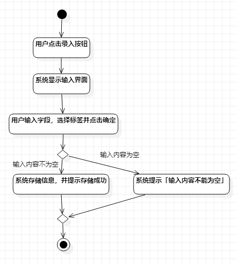
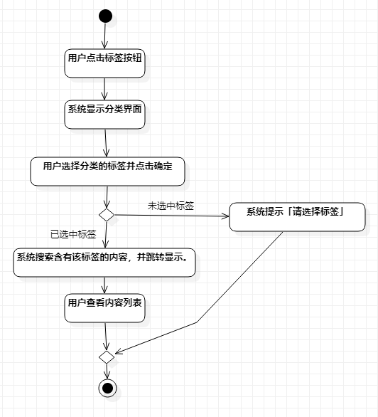
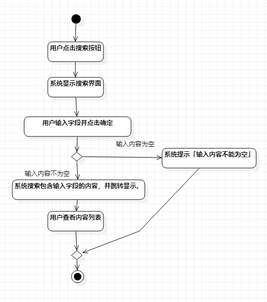

# 实验三

## 1. 实验目标
1. 掌握过程建模方法；
2. 掌握活动图的画法。（Activity Diagram）

## 2. 实验内容
- 使用StarUML画出活动图
- 按往常方法提交到GitHub
- 在GitHub平台新建一个.md文件并描述内容

## 3. 实验步骤
- 创建初始活动图
1. 添加initial和final节点。
2. 按照实验二的用例规，添加活动。
3. 两个活动间用控制流连接
4. 有分支的地方用Decision和Merge节点。
- 复查
1. 检查活动间的连接是否合理
2. 检查用词是否规范
- 调整
1. 假若更改了图中的Action节点，要在实验二的用例规约中做出相应的调整。
2. 对照用例规约和活动图，两边往返修改至合理且一致

## 4. 实验结果

图1：存储语句或段落的活动图

图2：按标签搜索内容的活动图

图3：按字段搜索内容的活动图
