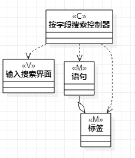

# 实验四:类建模;实验五:高级类建模

 ## 一、实验目标
- 掌握类建模方法；
- 了解MVC的设计模式（model、view、controller）；
- 掌握类图的画法。（Class Diagram）
- 理解类的5种关系
- 掌握类之间关系的画法。（Class Diagram）
## 二、实验内容
- 了解MVC设计模式；
- 根据用例规约绘制相应的类图；
- 上传github
- 在GitHub平台新建一个.md文件并描述内容。
  
## 三、实验步骤
- 了解MVC设计模式：
  1. Model为实体类
  2. View为用户操作的视图
  3. Controller为控制两者的控制器。
  4. Model和View不会互相交互，都由Controller进行联系或控制。

- 在StarUml中创建类图
  1. 根据用例规约，挖掘所需的类；
  2. 用MVC设计模式绘图
  - 了解类之间的关系，并连线。

## 四、实验结果

图1 存储语句或字段的类图

图2 按标签搜索的类图

图3  按字段搜索的类图

