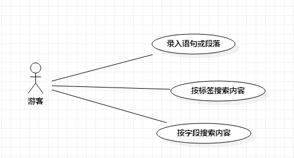

# 实验二

## 1. 实验目标
- 运用Markdown
- 画出选题的用例图

## 2. 实验内容
- 使用StarUML画出用例图
- 按往常方法提交到GitHub
- 在GitHub平台新建一个.md文件并描述内容

## 3. 实验步骤
- 确定用户——只有游客
- 确定用例
-- 存储语句或段落
-- 按标签搜索内容
-- 按字段搜索内容

## 4. 实验结果

图1：系统用例图

## 表1：  存储语句或字段的用例规约

用例编号  | UC01 | 备注  
-|:-|-  
用例名称  | 存储语句或段落  |   
前置条件  |     | *可选*   
后置条件  |     | *可选*   
基本流程  | 1. 用户点击录入按钮   |*用例执行成功的步骤*    
~| 2. 系统显示输入界面。 |   
~| 3. 用户输入字段，选择标签，并点击确定按钮。 |   
~| 4. 系统检查输入，存储信息，并提示「存储成功」。 |   
扩展流程  | 4.1 若用户的输入内容为空，则提示「输入内容不能为空」。  |*用例执行失败*    

## 表2：按标签搜索内容的用例规约
用例编号  | UC02 | 备注  
-|:-|-  
用例名称  | 按标签搜索内容  |   
前置条件  |     | *可选*   
后置条件  |  | *可选*   
基本流程  | 1. 用户点击标签查找按钮   |*用例执行成功的步骤*    
~| 2. 系统显示分类页面。 |   
~| 3. 用户选择分类的标签，并点击确认按钮。 |   
~| 4. 系统检查标签，搜索有该标签的内容，并跳转显示内容。 |   
~| 5. 用户查看内容列表。|  
扩展流程  | 4.1 若用户未选中标签即点击搜索，则提示「请选择标签」  |**    

## 表3：按字段搜索内容的用例规约
用例编号  | UC03 | 备注  
-|:-|-  
用例名称  | 按字段搜索内容  |   
前置条件  |     | *可选*   
后置条件  |  | *可选*   
基本流程  | 1. 用户点击搜索按钮   |*用例执行成功的步骤*    
~| 2. 系统显示搜索页面。 |   
~| 3. 用户输入字段，并点击确认按钮。 |   
~| 4. 系统检查输入，搜索包含输入字段的内容，并跳转显示内容。 |   
~| 5. 用户查看内容列表。|  
扩展流程  | 4.1 若用户输入为空，则提示「输入内容不能为空」  |**    
