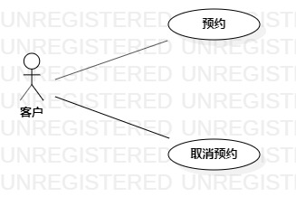

# 实验二：用例建模

## 一.实验目标

1.1 熟悉使用StarUML建模

1.2 熟悉使用git

## 二.实验内容
2.1 确定选题和功能

2.2 创建用例图

2.3 编写用例规约

## 三.实验步骤

3.1 在issue里提交选题和功能介绍

（1） 题目为#1247 牙医系统

（2） 功能为预约和取消预约

3.2 在StarUML上创建用例图

（1） 确定参与者为客户

（2） 添加用例为预约和取消预约

（3） 建立参与者与用例之间的联系

3.3 将用例图推送到git上

3.4 编写用例规约

（1） 编写预约用例规约

（2） 编写取消预约用例规约

## 四.实验结果

 

图1：牙医预约系统的用例图

## 表1：预约用例规约

用例编号  | UC01 | 备注  
 -|:-|-  
 用例名称  | 预约  |   
 前置条件  |  客户已登入牙医预约系统    | *可选*   
 后置条件  |     | *可选*   
 基本流程  | 1. 客户点击预约按钮；  |*用例执行成功的步骤*    
 ~| 2. 系统显示可预约医生界面；  |   
 ~| 3. 客户选择医生，点击确定按钮；  |   
 ~| 4. 系统检测该医生为空闲状态，保存医生状态信息；  | 
 ~| 5. 系统显示预约时间界面；  | 
 ~| 6. 客户选择预约时间，点击确定按钮；  | 
 ~| 7. 系统显示联系方式填写界面；  | 
 ~| 8. 客户输入内容，点击确定按钮；  | 
 ~| 9. 系统检测到输入内容不为空，保存上述所有内容后，提示“预约成功”；  |   
 ~| 10. 系统跳转到首页。  |  
 扩展流程  | 4.1 系统检测到该医生为忙碌状态，提示“该医生尚无空闲时间，请选择其他医生”；  |*用例执行失败* 
 ~| 9.1 系统检测到内容为空，提示“内容不为空”。  |
           
 
## 表2：取消预约用例规约
 
 用例编号  | UC02 | 备注  
 -|:-|-  
 用例名称  | 取消预约  |   
 前置条件  | 客户已登入牙医预约系统   | *可选*   
 后置条件  |      | *可选*   
 基本流程  | 1. 客户点击“我的预约”按钮；  |*用例执行成功的步骤*    
 ~| 2. 系统查找所有已预约的订单；  |   
 ~| 3. 系统显示已预约的订单；  |   
 ~| 4. 客户选择订单；  |   
 ~| 5. 系统显示该订单的信息；  |  
 ~| 6. 客户点击“取消预约按钮”；  |  
 ~| 7. 系统删除预约订单；  |  
 ~| 8. 系统提示取消成功。  |   
 扩展流程  |  2.1 系统没有查找到任何订单，系统显示“尚无预约”   |*用例执行失败*
