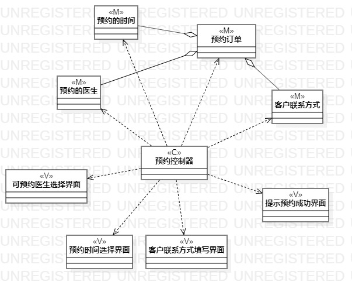
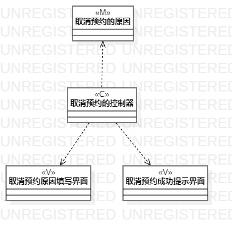

# 实验四、五

## 一、实验目标

1. 掌握类建模方法；
2. 了解MVC或你熟悉的设计模式；
3. 理解类的5种关系；
4. 掌握类图的画法。（Class Diagram）

## 二、实验内容

1. 基于MVC模式设计类；
2. 设计类的关系；
3. 画出类图。

## 三、实验步骤

1. 根据“预约用例”绘制类视图：

(1) 创建类： 
- M : 预约订单、预约的医生、预约的时间、客户联系方式。
- C : 预约控制器。
- V : 可预约医生选择界面、预约时间选择界面、客户联系方式填写界面、提示预约成功界面

(2) 绘制类间关系。 

2. 根据“取消预约用例”创建类： 

(1) 创建类： 
- M : 取消预约的原因。
- C : 取消预约控制器。
- V : 取消预约原因填写界面、取消预约成功提示界面。

(2) 绘制类间关系。

## 四、实验结果

  
图1  预约的类图

  
图2  取消预约的类图
