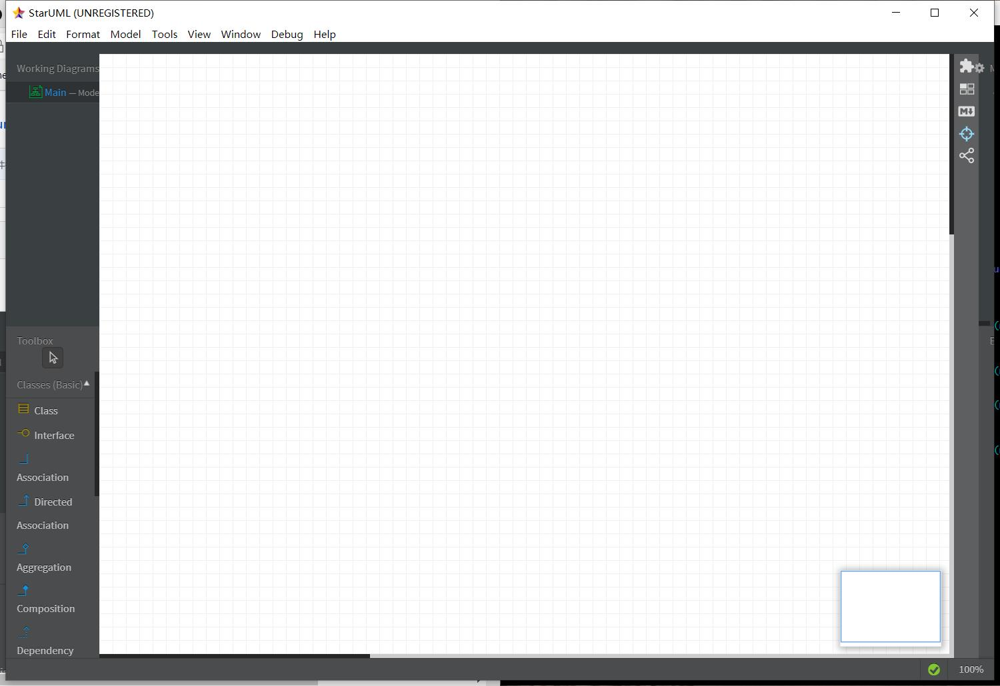

# 实验一

## 实验目标：

- 下载StarUML和Git
- 注册git账号
- 确认选题及其功能要求
- 建立第一个UML模型图
- 使用git上传本地使用文件
- 在GitHub将git上的文件发送至老师账号

## 实验内容：

### 截图：

### 选题：Hotaru记账

### 功能描述：

1. 支持分类别收入支出记账（交通、服饰）
2. 月度统计数据
3. 饼图显示各类别收入支出占比