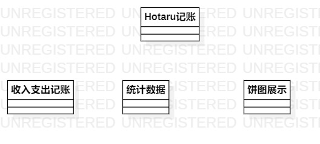

# 实验一：UML建模工具

## 一、实验目标
1. 熟悉GitHub实验过程
2. 安装与使用StarUML

## 二、实验内容
1. 安装StarUML并建立第一个图
2. 使用git完成实验并提交

## 三、实验步骤
1. 下载并安装Git和StarUML
2. fork项目到个人账号
3. git clone项目到本地磁盘
4. 在本地创建学号文件夹
5. 使用StarUML创建第一个UML图
6. 编辑lab1.md文档
7. git add添加lab1.md文档和UML图到暂存区
8. git commit提交到存储库
9. git push推送本地库到远程库
10. pull request提交实验

# 四、实验结果

图1. 在StarUML上创建的第一个图