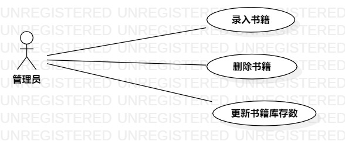

# 实验二：用例建模

## 一、实验目标
1. 创建个人选题
2. 掌握UML用例建模的概念和过程
3. 使用Markdown编辑实验报告

## 二、实验内容
1. 创建个人选题；
2. 使用StarUML绘制个人选题的用例图
3. 使用Markdown编辑实验二报告并完善实验一报告

## 三、实验步骤
1. 创建个人选题：书店仓库管理系统
2. 系统功能：
 - 书籍入库
 - 书籍出库
3. 使用StarUML绘制用例图
 - 根据功能建立Use Case
 - 确定系统的Actor
 - 建立Use Case和Actor之间的联系
4. 编辑用例规约

## 四、实验结果

图1. 书店仓库管理系统的用例图

## 表1：书籍入库用例规约  

用例编号  | UC01 | 备注  
-|:-|-  
用例名称  | 书籍入库  |   
前置条件  | 1. 管理员成功登录系统     | *可选*  
~| 2. 管理员进入书籍入库页面     |
后置条件  | 1. 系统显示入库记录     | *可选*   
基本流程  | 1. 管理员输入书籍信息；  |*用例执行成功的步骤*         
~| 2. 管理员点击确认按钮；  |    
~| 3. 系统检查输入是否完整，输入完整；  |   
~| 4. 系统检查库存数是否正确，库存数正确；  |  
~| 5. 系统保存书籍；  |   
~| 6. 系统生成入库记录。  |   
扩展流程  | 3.1 系统检查发现输入不完整，提示“输入不完整”；  |*用例执行失败*    
~| 4.1 系统检查发现书籍的库存数为非正整数，提示“库存数不正确”。 |  

## 表2：书籍出库用例规约  

用例编号  | UC02 | 备注  
-|:-|-  
用例名称  | 书籍出库  |   
前置条件  | 1. 管理员成功登录系统     | *可选*   
~| 2. 管理员进入书籍出库页面     |
后置条件  | 1. 系统显示出库记录     | *可选*   
基本流程  | 1. 管理员选择书籍；  |*用例执行成功的步骤*    
~| 2. 系统查询书籍；  |   
~| 3. 管理员输入出库数；  |   
~| 4. 管理员输入客户商信息；  |   
~| 5. 管理员点击确认按钮；  |   
~| 6. 系统检查输入是否完整，输入完整；  |   
~| 7. 系统检查出库数是否正确，出库数正确；  |  
~| 8. 系统更新库存数；  |   
~| 9. 系统生成出库记录。  |   
扩展流程  | 6.1 系统检查发现输入不完整，提示“输入不完整”；  |*用例执行失败*   
~| 7.1 系统检查发现出库数大于库存数或为非正整数，提示“出库数不正确”。  |   