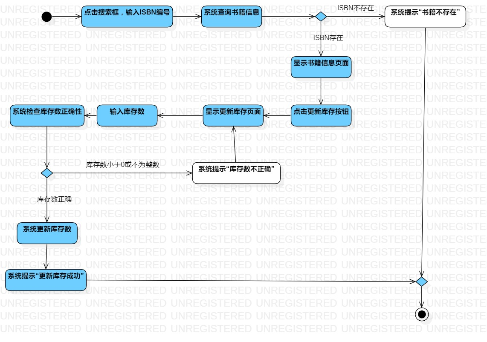

# 实验

## 一、实验目标
1. 掌握过程建模方法
2. 掌握活动图的画法（Activity Digram）

## 二、实验内容
1. 使用StarUML绘制个人选题的活动图
2. 编写实验报告

## 三、实验步骤
1. 观看教学视频
2. 修改实验二的用例规约
3. 根据录入书籍用例规约绘制录入书籍活动图
4. 根据删除书籍用例规约绘制删除书籍活动图
5. 根据更新书籍库存数用例规约绘制更新书籍库存数活动图
6. 编写实验报告

# 四、实验结果

图1. 录入书籍活动图

图1. 删除书籍活动图

图1. 更新书籍库存数活动图