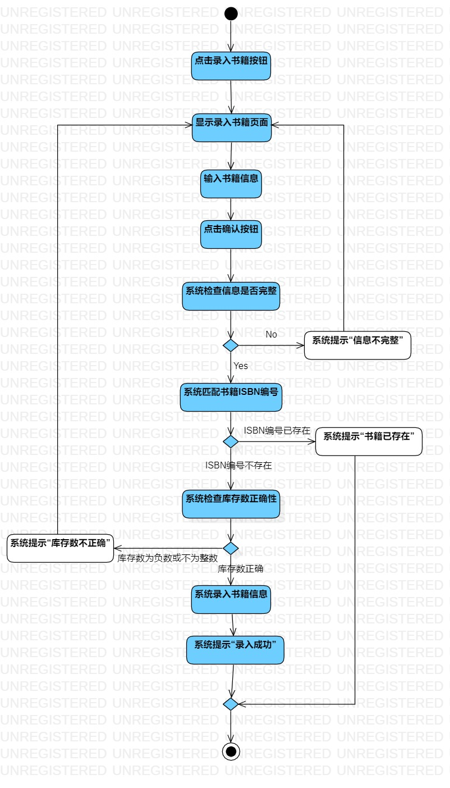
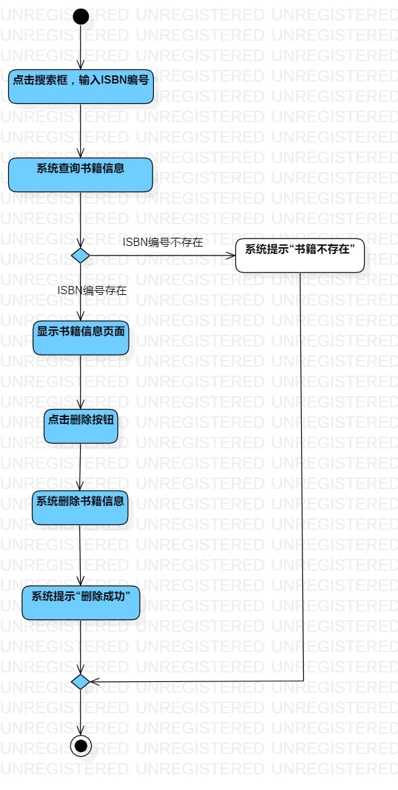

# 实验三：过程建模

## 一、实验目标
1. 掌握过程建模方法
2. 掌握活动图的画法（Activity Digram）

## 二、实验内容
1. 使用StarUML绘制个人选题的活动图
2. 编写实验报告

## 三、实验步骤
1. 观看教学视频
2. 修改实验二的用例规约
3. 根据书籍入库用例规约绘制书籍入库活动图
4. 根据书籍出库用例规约绘制书籍出库活动图

# 四、实验结果

图1. 书籍入库活动图

图2. 书籍出库活动图