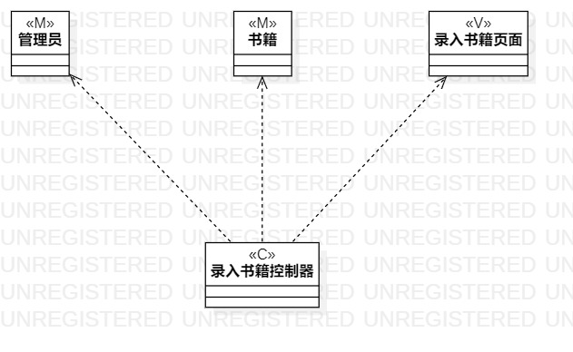
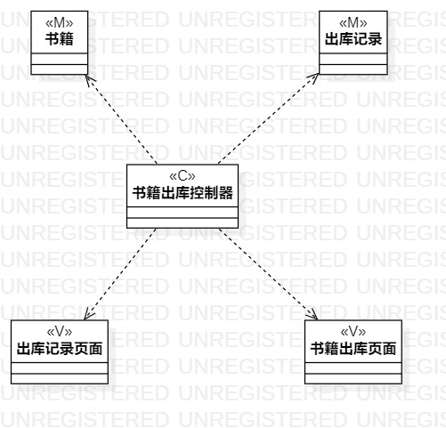

# 实验四、五：类建模和高级类建模

## 一、实验目标

1. 掌握类建模方法
2. 了解MVC设计模式
3. 掌握类图的画法（Class Diagram）
4. 理解类的5种关系
5. 掌握类之间关系的画法

## 二、实验内容

1. 基于MVC模式设计类
2. 设计类的关系
3. 画出类图

## 三、实验步骤

1. 观看教学视频
2. 基于MVC模式设计类
3. 从用例规约中寻找类
3. 使用StarUML绘制录入书籍类图、删除书籍类图、更新书籍库存数类图，分别画出：
  - 模型层(Model)  
  - 控制器层(Controller) 
  - 视图层(View)  
  - 类与类之间的关系 

## 四、实验结果

图1. 书籍入库类图

图2. 书籍出库类图