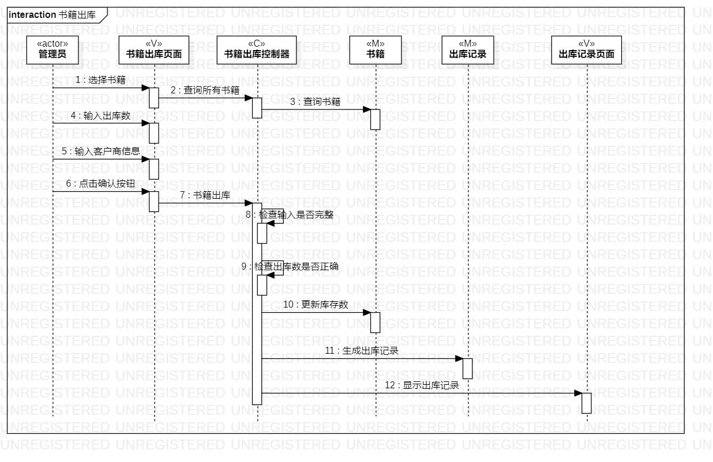

# 实验六：交互建模

## 一、实验目标
1. 理解系统交互
2. 掌握UML顺序图的画法
3. 掌握对象交互的定义与建模方法

## 二、实验内容
1. 根据用例模型和类模型，确定功能所涉及的系统对象
2. 在顺序图上画出参与者（对象）
3. 在顺序图上画出消息（交互）

## 三、实验步骤
1. 观看教学视频
2. 根据用例规约、活动图和类图设计顺序图
3. 绘出“书籍入库”顺序图
  - actor：管理员
  - M：书籍、入库记录
  - V：书籍入库页面、入库记录页面
  - C：书籍入库控制器
4. 绘出“书籍入库”顺序图
  - actor：管理员
  - M：书籍、出库记录
  - V：书籍出库页面、出库记录页面
  - C：书籍出库控制器

## 四、实验结果
 

图1：书籍入库顺序图

 

图2：书籍出库顺序图