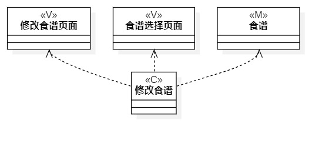

# 实验四&五 类建模

## 实验目标
1. 掌握类建模方法；
2. 了解MVC或你熟悉的设计模式；
3. 掌握类图的画法。（Class Diagram）

## 实验内容
1. 基于MVC模式设计类；
2. 设计类的关系；
3. 画出类图。

## 实验步骤
1. 修改实验三的活动图lab03_1.jpg
2. 修改并查看实验二的用例规约
3. 根据用例规约各个用例用到的类（Model、View、Controller）
3. 用线连接各个类表示它们之间的关系
    - 依赖Dependency（虚线箭头）
    - 关联Association（实线）
    - 聚合Aggregation（实线空心棱形）
    - 组合Composition（实线实心棱形）
    - 继承Inheritance（实线空心三角形）
5. 编写实验报告

## 实验结果
  
图1.录入食谱信息类图

  
图2.修改食谱信息类图