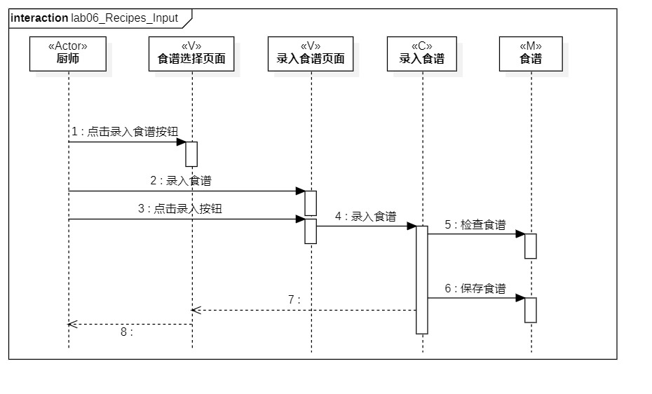
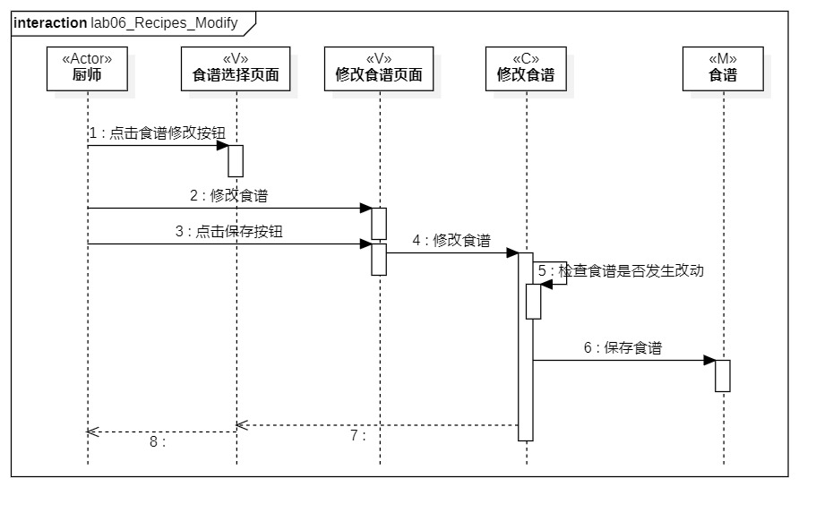

# 实验六：交互建模

## 1.实验目标
1. 理解系统交互；
2. 掌握UML顺序图的画法；
3. 掌握对象交互的定义与建模方法。

## 2. 实验内容
1. 根据用例模型和类模型，确定功能所涉及的系统对象；
2. 在顺序图上画出参与者（对象）；
3. 在顺序图上画出消息（交互）；

## 3. 实验步骤
1. 观看视频学习顺序图的知识  
2. 了解对象以及其画法；
3. 了解顺序图的构成、“时间顺序”的概念；
4. 了解顺序图的对象交互以及参与者的存活条；
5. 了解各种箭头对应的消息类型；
6. 从类图中找到以下参与者：
   #### I.录入食谱
   厨师（Actor）、食谱选择页面（V）、食谱录入页面（V）、录入食谱（C）、食谱（M）；
   #### II.修改食谱
   厨师（Actor）、食谱选择页面（V）、食谱修改页面（V）、修改食谱（C）、食谱（M）；
7. 根据活动图，按照顺序建立所有的Message
8. 在需要的位置建立Reply Message

## 4. 实验结果

  
图1.录入食谱的顺序图

  
图2.修改食谱的顺序图