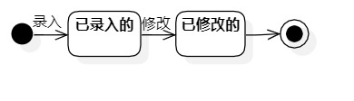

# 实验七：状态建模

## 一、实验目标

- 掌握对象状态建模（状态图，Statechart）

## 二、实验内容

1. 根据用例图、用例规约、活动图、类图、顺序图，确定关键对象

2. 画出状态图

## 三、实验步骤

1. 根据用例图、用例规约、活动图、类图、顺序图，确定关键对象：食谱

2. 找出对象攻略的相关状态

- 已录入的

- 已修改的

3. 添加“Initial State”、“Final State”、“Simple State”

4. 确定各状态之间的转换

5. 保存状态图并提交至GitHub

## 四、实验结果

图1：食谱的状态图