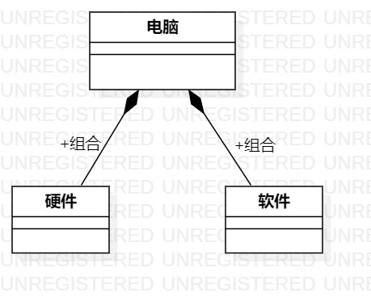

# 实验一

## 一、实验目标

学习并掌握StarUML和GitHub

## 二、实验内容

1. 熟悉GitHub的操作过程
2. 下载并安装建模工具 StarUML
3. 使用StarUML创建一个UML图

## 三、实验步骤

1. 下载并安装了StarUML
2. 将老师的项目fork到了自己的GitHub上面
3. clone项目到了本地
4. 创建并编辑.md文档
5. 用StarUML创建UML图
6. 用Git上传后在GitHub上编辑实验文档，插入UML图

## 四、实验结果
1.画图

  
图1.在StartUML上创建的第一个图

