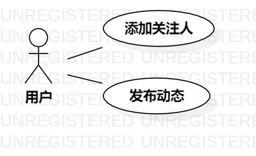

# 实验二：用例建模

## 一、实验目标

1. 掌握画用例图
2. 掌握如何编写用例规约

## 二、实验内容

1. 确定issues选题
2. 创建用例图
3. 根据用例图编写用例规约

## 三、实验步骤

1. 提交issues选题：米饭的追星系统
2. 根据选题确定参与者：用户
3. 根据选题确定用例：
  - 添加关注人
  - 发布动态
4. 创建用例图
5. 根据用例图，编写用例规约

## 四、实验结果
1. 画图  
  
图1. 米饭的追星系统用例图  
  

## 表1：添加关注人用例规约  

用例编号  | UC01 | 备注  
-|:-|-  
用例名称  | 添加关注人  |   
前置条件  |   用户打开要关注的人的主页   | *可选*   
后置条件  |      | *可选*   
基本流程  | 1. 用户点击"关注"按钮；  |*用例执行成功的步骤*    
~| 2. 系统检查用户已登录；  |   
~| 3. 系统检查关注人没有被关注，保存关注信息；  |   
~| 4. 系统提示"关注成功"。  |   
扩展流程  | 2.1 系统检查用户没有登录，提示请先登录。  |*用例执行失败*    
 ~| 3.1 系统检查关注人已被关注，提示此用户已被关注。  |    

## 表2：发布动态用例规约  

用例编号  | UC02 | 备注  
-|:-|-  
用例名称  | 发布动态  |   
前置条件  |   用户进入发布动态的编辑页面   | *可选*   
后置条件  |      | *可选*   
基本流程  | 1. 用户编辑动态内容；  |*用例执行成功的步骤*    
~| 2. 用户点击"提交"按钮；  |   
~| 3. 系统检查用户已登录；  |   
~| 4. 系统检查动态内容不为空；  |   
~| 5. 系统检查动态内容不违规，保存动态；  |   
~| 6. 提示发布成功；  |   
扩展流程  | 3.1 系统检查用户没有登录，提示请先登录。  |*用例执行失败*    
 ~| 4.1 系统检查动态内容为空，提示发布内容不能为空。  |    
 ~| 5.1 系统检查动态内容违规，提示发布失败。  |    