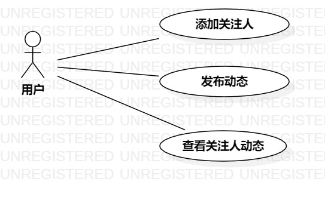

# 实验二：用例建模

## 一、实验目标

1. 掌握画用例图
2. 掌握如何编写用例规约

## 二、实验内容

1. 确定issues选题
2. 创建用例图
3. 根据用例图编写用例规约

## 三、实验步骤

1. 提交issues选题：米饭的追星系统
2. 根据选题确定参与者：用户
3. 根据选题确定用例：
  - 添加关注人
  - 发布动态
  - 查看关注人动态
4. 创建用例图
5. 根据用例图，编写用例规约

## 四、实验结果
1. 画图
  
图1. 米饭的追星系统用例图  
  

## 表1：添加关注人用例规约  

用例编号  | UC01 | 备注  
-|:-|-  
用例名称  | 添加关注人  |   
前置条件  |   用户登陆系统   | *可选*   
后置条件  |   用户进入米饭的追星系统首页   | *可选*   
基本流程  | 1. 用户点击"添加"按钮；  |*用例执行成功的步骤*    
~| 2. 系统显示搜索页面；  |   
~| 3. 用户输入关注人姓名，点击"搜索"按钮；  |   
~| 4. 系统检索关注人姓名成功；  |   
~| 5. 系统显示关注人主页；  |   
~| 6. 用户点击"关注"按钮，提示关注成功。  |   
扩展流程  | 4.1 系统检索关注人姓名失败，提示没有此用户。  |*用例执行失败*    

## 表2：发布动态用例规约  

用例编号  | UC02 | 备注  
-|:-|-  
用例名称  | 发布动态  |   
前置条件  |   用户登陆系统   | *可选*   
后置条件  |   用户进入我的动态界面   | *可选*   
基本流程  | 1. 用户点击"发布"按钮；  |*用例执行成功的步骤*    
~| 2. 用户进入编辑页面；  |   
~| 3. 系统检测没有违规内容，保存动态，提示发布成功；  |   
~| 4. 系统显示我的动态页面。  |   
扩展流程  | 3.1 系统检测有违规内容，提示发布失败。  |*用例执行失败*    

## 表3：查看关注人动态用例规约  

用例编号  | UC03 | 备注  
-|:-|-  
用例名称  | 查看关注人动态  |   
前置条件  |   用户登陆系统   | *可选*   
后置条件  |   用户进入米饭的追星系统首页   | *可选*   
基本流程  | 1. 用户点击"我的关注"按钮；  |*用例执行成功的步骤*    
~| 2. 系统显示我的关注页面；  |   
~| 3. 用户点击关注人；  |     
~| 4. 系统检索关注人信息成功；  |     
~| 5. 系统显示关注人动态页面。  |    
扩展流程  | 4.1 系统检索关注人信息失败，提示加载失败。  |*用例执行失败*    