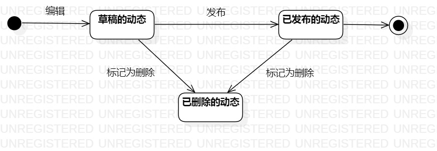

# 实验七:状态建模

## 一、实验目标

1. 掌握对象状态建模（状态图，Statechart）。

## 二、实验内容

1. 寻找一个关键的对象；
2. 设计该对象的关键状态；
3. 设计状态之间的转变条件。

## 三、实验步骤

1. 根据自己的用例规约、活动图、类图和顺序图，选择关键的对象；
2. 确定了要绘制状态图的对象是“动态”
3. 找出动态的相关状态
  - 草稿的
  - 发布的
  - 已删除的
4. 绘制状态图
5. 添加相关的结点

## 四、实验结果

图1 动态的状态图  
