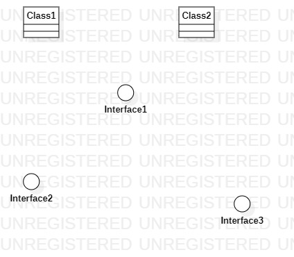

# 实验一

## 一、实验目标
1. 下载StarUML软件。
2. 学会GitHub的基本使用

## 二、实验内容
1. 下载并安装建模工具 StarUML，下载地址：http://staruml.io
2. 确定个人建模选题，将选题填写在 Issues 中：
https://github.com/hzuapps/uml-modeling-2020/issues
3. 下载并安装建模工具 StarUML。
4. 下载GUI，并上传文件至GitHub，并实现拉取到老师的库中。

## 三、实验步骤
1. 根据课程要求下载相关软件（git、StarUML等）
2. 在github上fork实验项目后，clone到本地磁盘
3. 根据视频内容编写Markdown文档
4. 将实验文档上传到github自己的仓库里
5. Pull Request将实验文档请求合并到主仓库

## 四、实验结果
 画图

