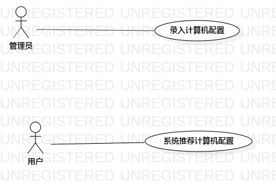

# 实验二：用例建模

## 实验目标
1. 理解用例的概念
2. 使用用例建模
3. 学会编写用例规约

## 实验内容

1. 细化功能需求
2. 对自己的选题用例建模
3. 编写用例规约

## 实验步骤
1. 确定选题为计算机配置推荐系统
2. 根据选题创建用例图
3. 确定参与者
   -管理员（Actor）
   -用户（Actor)
4. 确定用例
   -录入计算机配置（Use case）
   -系统推荐计算机配置（Use case）
5. 绘制用例图
6. 编写用例规约

## 实验结果

图1：计算机配置推荐用例图

## 表1：录入计算机配置用例规约的编写

用例编号  | UC01 | 备注  
-|:-|-  
用例名称  | 录入计算机配置  |   
前置条件  |   录入界面已打开   | *必要*   
后置条件  |      | *可选*   
基本流程  | 1.管理员点击录入按钮;  |*用例执行成功的步骤*    
~| 2. 管理员在录入界面输入相应配置信息  |   
~| 3. 系统检查配置信息，不存在相同配置信息，系统保存配置信息 |   
~| 4. 系统提示录入成功  |  
扩展流程  | 3.1 检测到存在相同配置信息，保存配置信息失败  |*用例执行失败*    

## 表2：推荐计算机配置用例规约的编写 

用例编号  | UC02 | 备注  
-|:-|-  
用例名称  | 推荐计算机配置  |   
前置条件  |    计算机配置已录入且界面已打开  | *必要*   
后置条件  |      | *可选*   
基本流程  | 1.用户根据预算在系统界面输入价格  |*用例执行成功的步骤*    
~| 2. 用户点击查询按钮  |   
~| 3. 系统检查输入的价格  |   
~| 4. 系统基于用户输入的价格查询相匹配的配置信息  |   
~| 5. 系统提示“查询成功”并弹出配置信息界面  |
扩展流程  | 3.1 系统检测出输入不合法  |*用例执行失败*    

