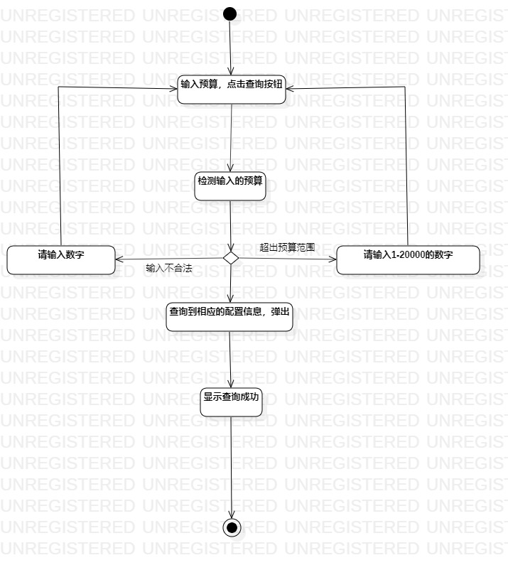

# 实验三

## 一、实验目标
1. 掌握过程建模方法；
2. 掌握活动图的画法。（Activity Diagram）

## 二、实验内容
1. 根据实验二用例规约以及老师的讲义视频完成活动图
2. 填写实验报告

## 三、实验步骤
1. 在StarUML中创建活动图
2. 创建Initial和Final两个点表示开始与结束
3. 根据实验二用例规约添加Action，并添加Control Flow将它们连接起来
4. 完善整个实验的活动图
5. 填写实验报告

## 四、实验结果

 
 
 图1.录入的活动图

 
 
 图2.推荐的活动图
