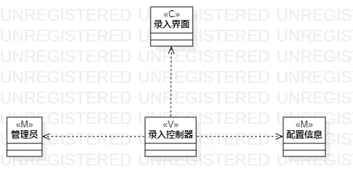
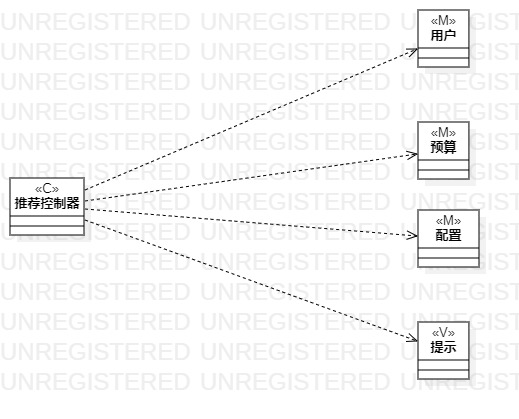

# 实验四：类建模 & 实验五：高级类建模

## 一、实验目标
1. 掌握类建模方法；
2. 了解MVC或你熟悉的设计模式；
3. 掌握类图的画法。（Class Diagram）
4. 理解类的5种关系
5. 掌握类之间的关系的画法。（Class Diagram）

## 二、实验内容
1. 基于MVC模式设计类；
2. 设计类的关系；
3. 画出类图。

## 三、实验步骤
1. 在StarUML中创建MVC模式设计类图
2. 按照用例规约所画的图添加相应的类图
3. 根据各个类之间的关系将它们连接起来
4. 完善整个实验的活动图
5. 填写实验报告

## 四、实验结果

 
 
 图1.录入MVC图

 
 
 图2.推荐的MVC图
