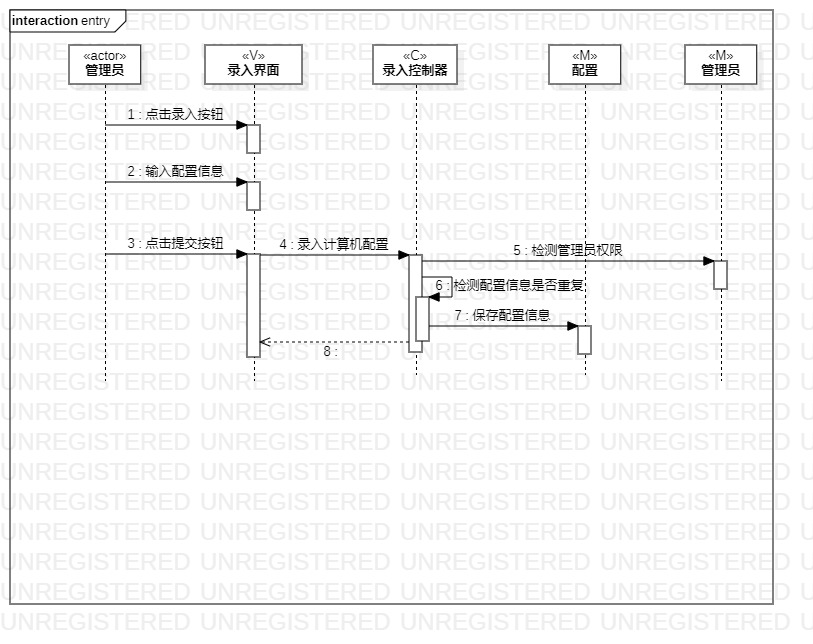
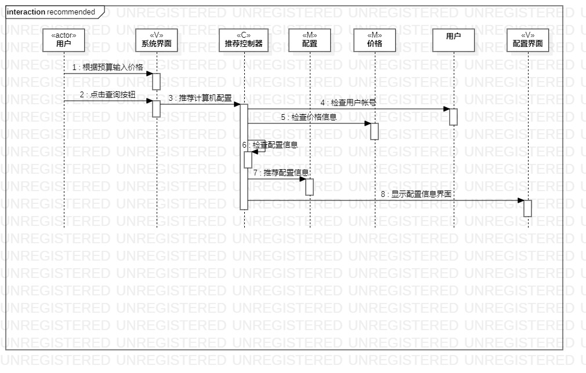

# 实验六：交互建模

## 一、实验目标
1. 理解系统交互；
2. 掌握UML顺序图的画法；
3. 掌握对象交互的定义与建模方法。

## 二、实验内容
1. 根据用例模型和类模型，确定功能所涉及的系统对象；
2. 在顺序图上画出参与者（对象）；
3. 在顺序图上画出消息（交互）。

## 三、实验步骤
1. 在StarUML中创建顺序图
2. 画个用例图的上actor以及各个类图
3. 依据用例图将它们按照顺序联系起来
4. 完善整个实验的顺序图
5. 填写实验报告

## 四、实验结果

 
 
 图1.录入的顺序图

 
 
 图2.推荐的顺序图
