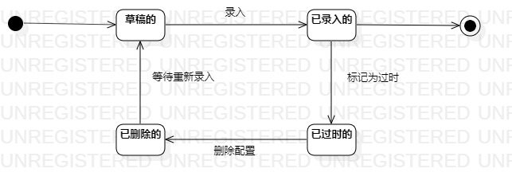

# 实验七：状态建模

## 一、实验目标
1. 掌握对象状态建模（状态图，Statechart）；

## 二、实验内容
1. 根据用例，确定用来建模的对象；
2. 根据这个对象来画状态图；
3. 完善自己的状态图。

## 三、实验步骤
1. 在StarUML中创建状态图
2. 用确定的对象来画出这个对象的所有重要状态
3. 将各个状态联系起来
4. 完善整个实验的状态图
5. 填写实验报告

## 四、实验结果

 
 
 图1.配置的状态图

