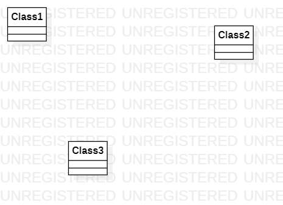

# 实验一

## 实验目标

​	1.搭建UML的学习环境和工具；

​	2.克隆Github实验库，学习Git相关的操作；

​	3.运用StarUML工具创建第一个UML图;

​	4.确定选题，并填写issues。

## 实验内容

​	1.下载并安装建模工具 StarUML ；

​	2.Fork项目到自己Github账号下，并克隆到本地仓库；在students目录下创建以自己学号命名的目录，并新建lab1.md文件，通过commit和push到github账号项目下。

​	3.用StarUML创建一个简单的UML图，导出到本地项目中进行push。

​	4.在github上的项目中插入图片，然后commit；用git pull保持本地与线上同步；随后pull request提交。

## 实验结果

## Issues 选题：口罩预约小程序

​	功能描述： 

​	1.口罩买家填写个人资料； 

​	2.口罩买家提交预约订单。 ​

​	（ps：情景：非快递邮货，由用户自行前往选择的门店自提；） 