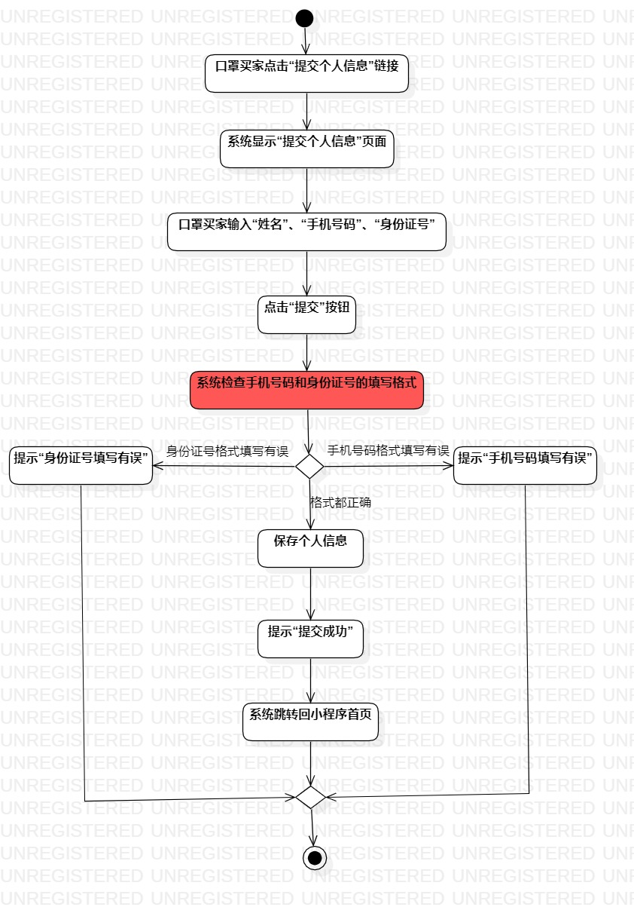
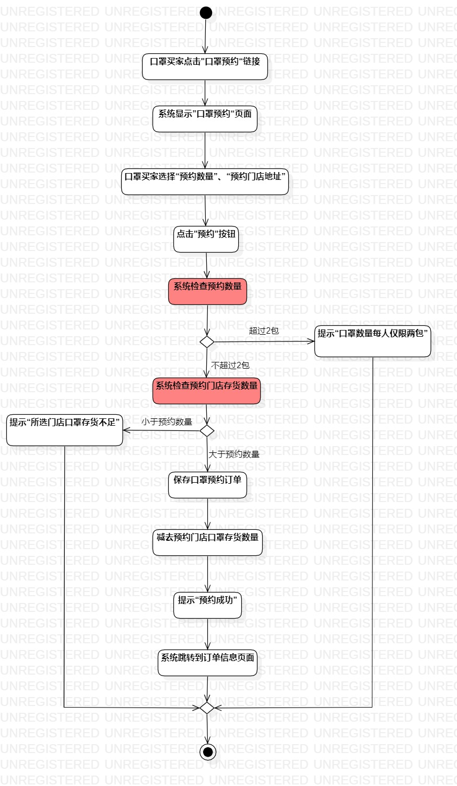

# 实验三

## 一、实验目标

1.学会过程建模的相关原理知识；

2.熟悉活动图的画法和规则。

## 二、实验内容

1.观看实验相关视频和阅读实验文档；

2.回顾实验二用例规约的流程；

3.用StarUML绘制活动图；

4.编写实验报告。

## 三、实验步骤

1.在StarUML新建两个ActivityDiagram：

（1）填写个人资料；

（2）提交预约订单。

2.根据实验二用例规约绘图：

（1）新建Initial结点和Final结点；

（2）绘制动作和决策图形来表示整个基本流程和扩展流程。

3.检查活动图与用例规约的流程一致。

## 四、实验结果

图1 填写个人资料活动图

图2 提交预约订单活动图