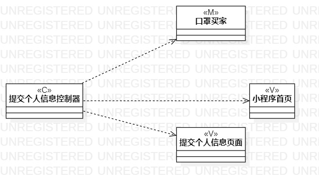
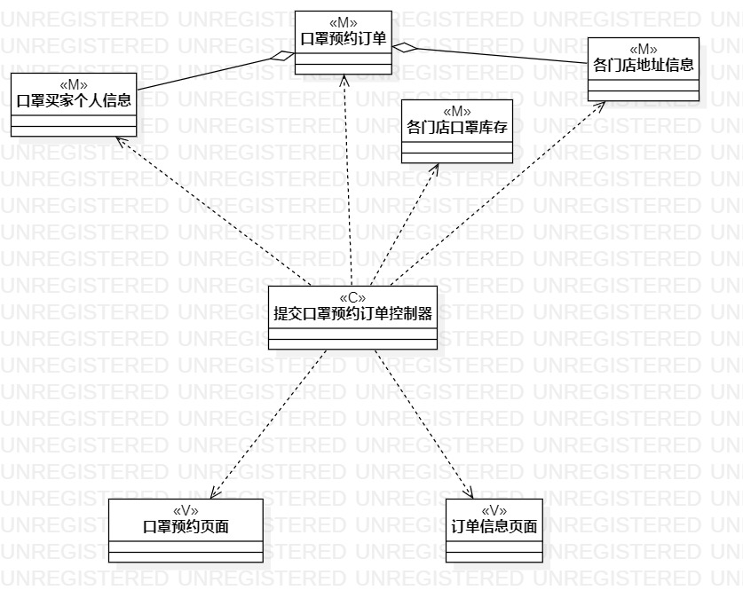

# 实验四&五：类建模

## 一、实验目标

1.掌握类建模方法；

2.了解MVC或你熟悉的设计模式；

3.掌握类图的画法。

## 二、实验内容

1.基于MVC模式设计类；

2.设计类的关系；

3.画出类图。

## 三、实验步骤

1.创建“填写个人资料”类项目：

- 创建填写个人资料控制器类图、买家类图和个人资料页面类图。
- 用依赖线分别连接填写个人资料控制器类图与其他各类图。

2.创建“提交预约订单”类项目：

- 创建提交预约订单控制器类图、买家类图、预约订单类图、口罩库存类图和口罩预约页面类图。
- 用依赖线连接提交预约订单控制器类图与其他各类图；再用聚合线连接买家类图与预约订单类图。

## 四、实验结果

  

图1 填写个人资料类图

图1说明：由于是小程序，可根据自动获取的微信openId来区分买家的身份，并与提交的个人资料合为一个类。因此并没有单独的登录账号类。

     

图2 提交预约订单类图

