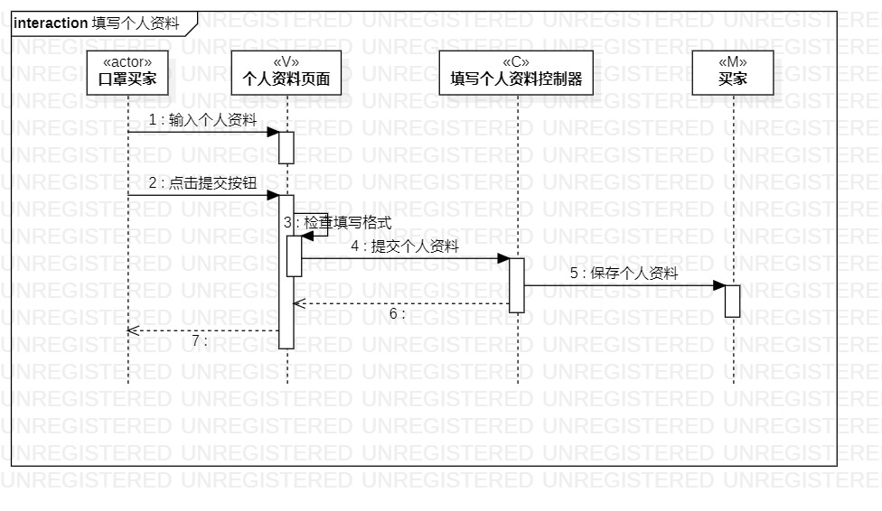

# 实验六：交互建模

## 一、实验目标

1.理解系统交互；

2.掌握UML顺序图的画法；

3.掌握对象交互的定义与建模方法。

## 二、实验内容

1.根据用例模型和类模型，确定功能所涉及的系统对象；

2.在顺序图上画出参与者（对象）；

3.在顺序图上画出消息（交互）。

## 三、实验步骤

1.创建“填写个人资料”顺序图；

- 画出3+1个参与者，分别是口罩买家（actor）、个人资料页面、填写个人资料控制器和买家。
- 根据实验3的活动图，画出消息。

2.创建“提交预约订单”顺序图；

- 画出5+1个参与者，分别是口罩买家（actor）、口罩预约页面、提交预约订单控制器、买家、口罩库存和预约订单。
- 根据实验3的活动图，画出消息。

3.检查参与者与实验4的类图是否一致，时间顺序是否与实验3活动图一致。

## 四、实验结果

    

图1 填写个人资料顺序图

    

图2 提交预约订单顺序图

