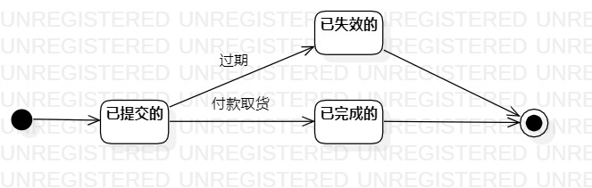

# 实验七：状态建模

## 一、实验目标

1.掌握对象状态建模（状态图，Statechart）。

## 二、实验内容

1.根据选题功能，找准关键的对象；

2.设计对象的状态；

3.设计状态之间的转变条件；

4.画出对象的状态图；

5.完成实验报告。

## 三、实验步骤

1.确定对象为预约订单；

2.创建名为“预约订单的状态图”的StatechartDiagram；

3.新建Initial结点和Final结点；

4.新建预约订单的三个状态，分别为“已提交的”、“已失效的”、“已完成的”；

5.用转变线条分别将三个状态之间的转变条件画出来。

## 四、实验结果

    

图1 预约订单的状态图

图1说明：买家提交预约订单后，是去门店付款自提，并非线上交易。因此预约订单没有“已发货的”等其他状态。