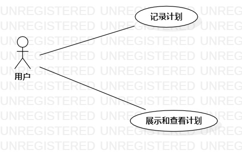

# 实验二：用例建模

## 一、 实验目标

1. 学会使用Markdown编写实验报告
2. 学会使用StarUML绘制用例图
3. 学会编写用例规约

## 二、 实验内容

1. 细化系统功能
2. 绘制用例图
3. 编写用例规约

## 三、 实验步骤

1. 细化系统功能
   1）管理者编辑计划：管理者编辑计划组计划
   2）建立计划组：管理者添加计划组成员用户
2. 确定参与者：管理者，用户
3. 添加用例：管理者编辑计划，建立计划组
4. 建立参与者与用例之间的联系
5. 绘制用例图
6. 编写用例规约

## 四、实验结果

ToDo系统用例图

### 表一：管理者编辑计划规约

| **用例编号** | **UC01**                           | **备注** |
| :----------- | ---------------------------------- | -------- |
| 用例名称     | 管理者编辑计划                     |          |
| 前置条件     | 管理者进入计划组计划编辑页面       |          |
| 后置条件     |                                    |          |
| 基本流程     | 1.单击编辑记录按钮；               |          |
|              | 2.系统显示进入选择计划编辑界面；   |          |
|              | 3.选择新增计划或编辑已存在计划；   |          |
|              | 4.进入编辑计划界面进行编辑；       |          |
|              | 5.点击保存按钮；                   |          |
|              | 6.系统保存计划；                   |          |
|              | 7.系统提示保存成功；               |          |
|              | 8.系统更新计划组的计划列表。       |          |
| 扩展流程     | 7.1.系统保存失败，提示“保存失败”； |          |
|              | 7.2.留在编辑计划界面。             |          |

### 表二：建立计划组规约

| **用例编号** | **UC02**                                         | **备注** |
| ------------ | ------------------------------------------------ | -------- |
| 用例名称     | 建立计划组                                       |          |
| 前置条件     |                                                  |          |
| 后置条件     |                                                  |          |
| 基本流程     | 1.管理者点击新建计划组按钮；                     |          |
|              | 2.系统显示查询用户页面；                         |          |
|              | 3.输入用户名称，点击完成按钮；                   |          |
|              | 4.系统判断用户名称不为空，查询用户;              |          |
|              | 5.管理员点击添加成员按钮，计划组新增成员用户。   |          |
| 扩展流程     | 4.1.系统检查计划名为空，提示“计划名称不能为空”； |          |
|              | 4.2.系统查询不到计划，提示“查询不到计划”。       |          |