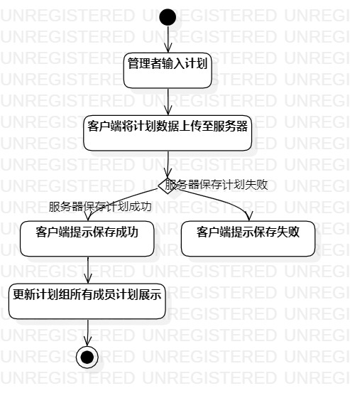
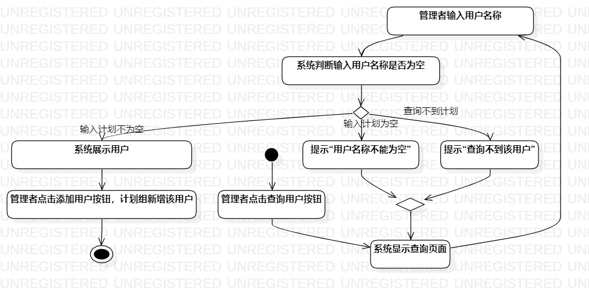

# 实验三：过程建模

## 一、实验目标

1. 掌握过程建模方法
2. 掌握活动图的画法。（Activity Diagram）

## 二、实验步骤

- 创建Activity Diagram
- 加初始结点、添加结束结点
- 添加活动、分支处添加决策
- 添加流程线、调整整体

## 三、画图要点

1. 把基本流程和扩展流程的动作画为操作（Action）
2. 在出现分支的操作之后使用决策（Decision）节点

## 四、实验结果

图一：管理者编辑计划活动图

图二：建立计划组活动图

