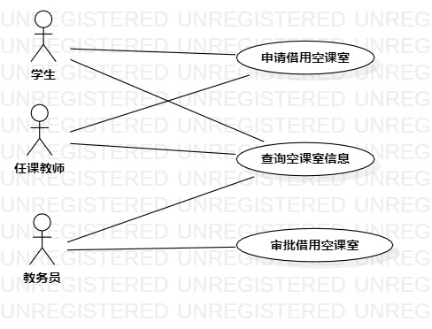

# 实验二：用例建模

## 一、实验目标

1. 完善选题
2. 使用StarUML完成用例建模
3. 使用Markdown编写文档

## 二、实验内容

1. 细化功能需求。
2. 画出用例图
3. 编写用例规约

## 三、实验步骤

1. 选题为空课室管理系统
2. 根据issues在StarUML上创建用例图（Lab2_UseCaseDiagram）
3. 确定参与者（Actor）:  
      - 学生
      - 任课教师
      - 教务员
4. 确定用例（UserCase）:   
      - 查询空课室
      - 申请空课室
      - 审批空课室申请
5. 建立Actor和UserCase之间的联系
6. 绘画用例图（Lab2_UseCaseDiagram）
7. 编写用例规约

## 四、实验结果

  
图1：空课室管理系统的用例图

## 表1：查询空课室用例规约  

 用例编号  | UC01 | 备注  
-|:-|-  
用例名称  | 查询空课室  |   
前置条件  |  学生、任课教师或教务员登录进入空课室查询系统   |   
后置条件  | 学生、任课教师或教务员进入查询结果页面     |    
基本流程  | 1. 学生、任课教师或教务员输入教学楼名称；  |    
~| 2. 学生、任课教师或教务员输入楼层；  |   
~| 3. 系统查找教学楼表和对应楼层表，检查该教学楼存在该楼层，读取该楼层空课室信息；  |     
~| 4. 系统显示空课室信息页面。  |  
扩展流程  | 3.1 系统检查教学楼不存在该楼层，提示“输入的楼层不正确，请重新输入”； |  
 

## 表2：申请空课室用例规约  

 用例编号  | UC02 | 备注  
-|:-|-  
用例名称  | 申请空课室  |   
前置条件  |  学生或任课教师登录进入空课室管理系统   |    
后置条件  |    |    
基本流程  | 1. 学生或任课教师点击申请空课室链接；  |    
~| 2. 系统显示空课室申请填写页面；  |   
~| 3. 学生或任课教师填写申请信息，点击提交按钮；  |   
~| 4. 系统查询该课室占用信息，检查课室未占用，保存申请信息；  |   
~| 5. 系统显示提交成功页面。  |  
扩展流程  | 4.1 系统检查课室已被占用，提示“该课室已被占用”；  |    
 
## 表3：审批空课室申请用例规约  

 用例编号  | UC03 | 备注  
-|:-|-  
用例名称  | 审批空课室申请  |   
前置条件  |  教务员登录进入空课室管理系统   |    
后置条件  |     |   
基本流程  | 1. 教务员点击审批空课室申请链接；  |    
~| 2. 系统显示空课室申请信息页面；  |   
~| 3. 教务员查阅申请内容，点击通过或不通过按钮；  |   
~| 4. 系统查询学生或任课教师邮箱信息，检查邮箱信息正确，保存审批结果并发送到邮箱； |   
~| 5. 系统显示审批完成页面。  |  
扩展流程  | 4.1 系统检查邮箱信息不正确，提示“该邮箱信息不正确，请使用其他联系方式”。  |

