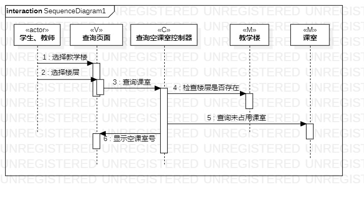
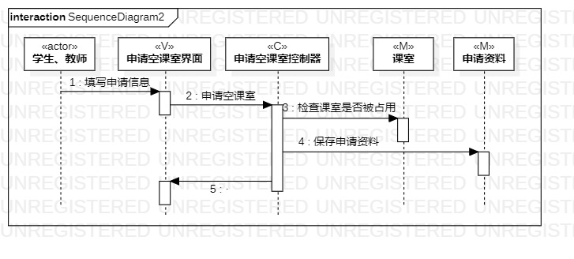
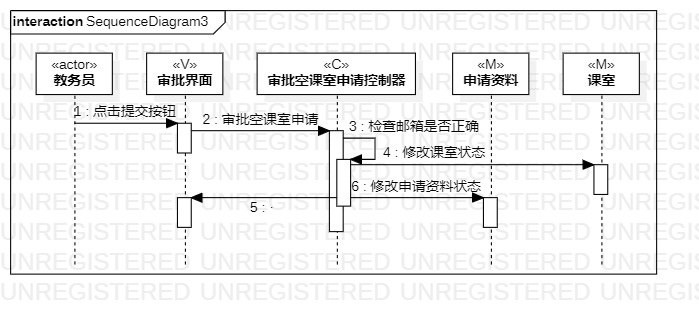

# 实验六：对象交互建模

 ### 一、实验目标
1. 理解系统交互；  
2. 掌握UML顺序图的画法；  
3. 掌握对象交互的定义与建模方法。  

 ### 二、实验内容
1. 根据用例模型和类模型，确定功能所涉及的系统对象；  
2. 在顺序图上画出参与者（对象）；  
3. 在顺序图上画出消息（交互）。  

  ### 三、实验步骤
1. 从用例图找到一个参与者；
2. 从类图找到N个参与者，总共1+N个参与者；
3. 从活动图找到操作步骤，画出参与者之间的消息。

 ### 四、实验结果

     
   图1.查询空课室顺序图

     
   图2.申请空课室顺序图  
   
     
   图3.审批空课室申请顺序图
