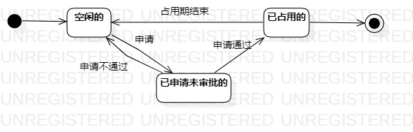

# 实验七：状态建模

 ## 一、实验目标

 1. 掌握状态图及其画法（状态图，Statechart）

 ## 二、实验内容

1. 找到1个重要的对象；
2. 寻找这个对象的所有关键状态；
3. 画出状态之间的转换条件。

 ## 三、实验步骤

 1. 找到一个关键的对象

 - 课室

 2. 设计该对象的关键状态

 - 与课室有关的状态： 空闲的、已申请未审批的、已占用的。

 3. 设计状态之间的转变条件
4. 绘制状态图

 ## 四、实验结果

 

 **图1：课室的状态图**
