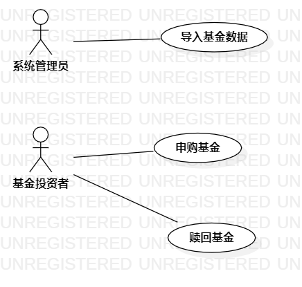

# 实验二：用例建模

## 一、实验目标
1、理解用例图概念并掌握其画法

2、掌握用例规约的编写步骤

3、掌握markdown常用语法

## 二、实验内容
1、细化功能需求

2、画出用例图（Use Case Diagram）

3、编写用例规约（表格）

## 三、实验步骤
1、确定系统功能需求：

​	（1）导入基金

​	（2）查看基金

​	（3）申购基金

​	（4）赎回基金

2、创建用例：

​	（1）导入基金数据

​	（2）申购基金

​	（3）赎回基金

3、确定参与者：

​	（1） 系统管理员

​	（2）基金投资者

4、编写用例规约：

​	（1）用例规约1：如表1

​	（2）用例规约2：如表2

​	（3）用例规约3：如表3

## 四、实验结果
1、画图

图4.1：实验2-基金申赎系统用例图

## 表1：导入基金数据用例规约  

用例编号  | FUND01 | 备注  
-|:-|-  
用例名称  | 导入基金数据 |   
前置条件  | 管理员登录系统 | *可选*   
后置条件  | 系统导入基金数据 | *可选*   
基本流程  | 1. 管理员点击“导入数据”按钮 |*用例执行成功的步骤*    
~| 2. 系统查询基金最新动态数据，返回“确认导入”按钮 |   
~| 3. 管理员点击“确认导入”按钮 |   
 ~        | 4.系统导入基金最新数据，提示“导入成功”                         |                      
 扩展流程 | 2.1 系统检查基金数据无更新，**提示“已是最新数据”**； | *用例执行失败*       

## 表2：申购基金用例规约  

| 用例编号 | FUND02                                                       | 备注                 |
| -------- | :----------------------------------------------------------- | -------------------- |
| 用例名称 | 申购基金                                                     |                      |
| 前置条件 | 用户登录系统，进入“**基金列表**”页面                         | *可选*               |
| 后置条件 | 系统提示“**申购基金成功**”                                   | *可选*               |
| 基本流程 | 1. 用户点击任一基金，进入“**基金详情页**”                    | *用例执行成功的步骤* |
| ~        | 2. 系统查询基金信息，显示基金详情页面                        |                      |
| ~        | 3. 用户点击申购按钮，填写基金“**申购份额**”，点击确认        |                      |
| ~        | 4. 系统弹出支付订单                                          |                      |
| ~        | 5.用户支付订单                                               |                      |
| ~        | 6.系统更新基金份额，提示“**支付成功**”                       |                      |
| 扩展流程 | 5.1 用户支付订单失败，**提示“基金已售罄，请留意基金最新动态”**； | *用例执行失败*       |

## 表3：赎回基金用例规约  

| 用例编号 | FUND03                                          | 备注                 |
| -------- | :---------------------------------------------- | -------------------- |
| 用例名称 | 赎回基金                                        |                      |
| 前置条件 | 用户登录系统，进入“**已购基金**”页面            | *可选*               |
| 后置条件 | 系统提示“**赎回基金成功**”                      | *可选*               |
| 基本流程 | 1. 用户点击“**已购基金**”按钮                   | *用例执行成功的步骤* |
| ~        | 2. 系统查询用户已购基金信息，显示已购基金列表   |                      |
| ~        | 3. 用户点击期望赎回基金的“**赎回**”按钮         |                      |
| ~        | 4. 系统弹出赎回订单，提示用户输入“**赎回份额**” |                      |
| ~        | 5. 用户输入“**赎回份额**”，点击确认按钮         |                      |
| ~        | 6.系统更新基金份额，提示“**基金赎回成功**”      |                      |
| 扩展流程 |                                                 |                      |