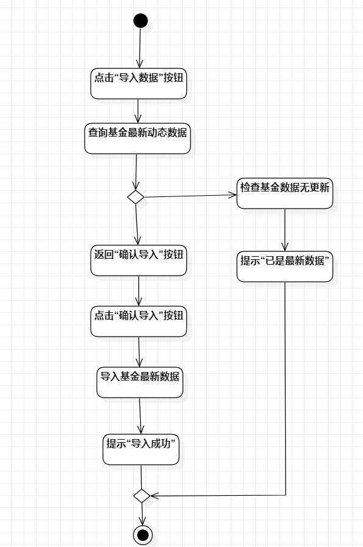
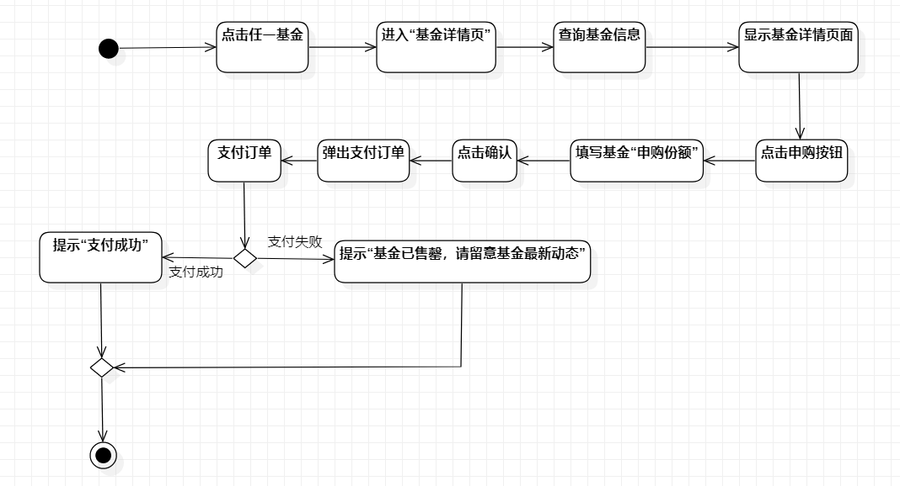
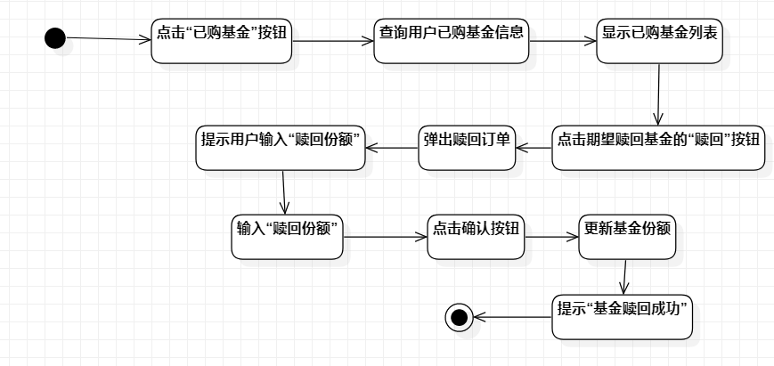

# 实验三：过程建模

## 一、实验目标
1、掌握过程建模方法

2、掌握活动图的画法

## 二、实验内容
1、参照实验二用例规约创建活动图

## 三、实验步骤
1、创建活动图

2、添加initial和final

3、参照用例规约添加action

4、添加decision到扩展流程

5、使用control flow连接

## 四、实验结果
1、画图

图1：导入基金数据活动图

图2：申购基金活动图

图3：赎回基金活动图