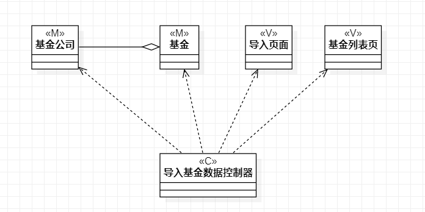
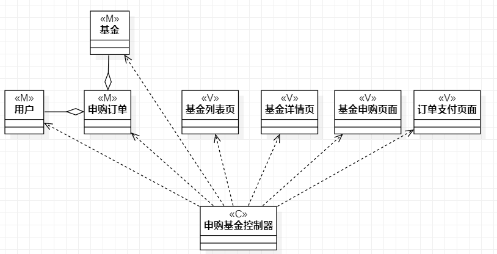
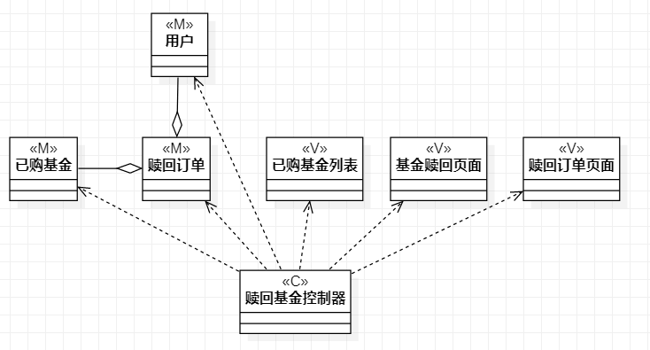

# 实验四：类建模

## 一、实验目标
1、掌握类建模方法

2、了解MVC设计模式

3、掌握类图的画法。（Class Diagram）

## 二、实验内容
1、参照实验二用例规约创建类图

## 三、实验步骤
1、创建类图

2、设计系统model类

3、设计系统view类

4、设计系统controller类

## 四、实验结果
1、画图

图1：实验4与实验5-导入基金数据类图

图2：实验4与实验5-申购基金类图

图3：实验4与实验5-赎回基金图
