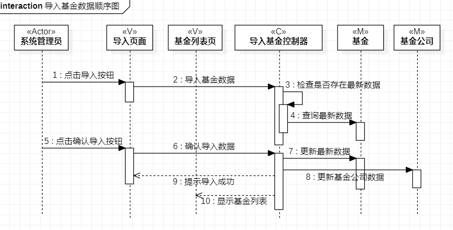
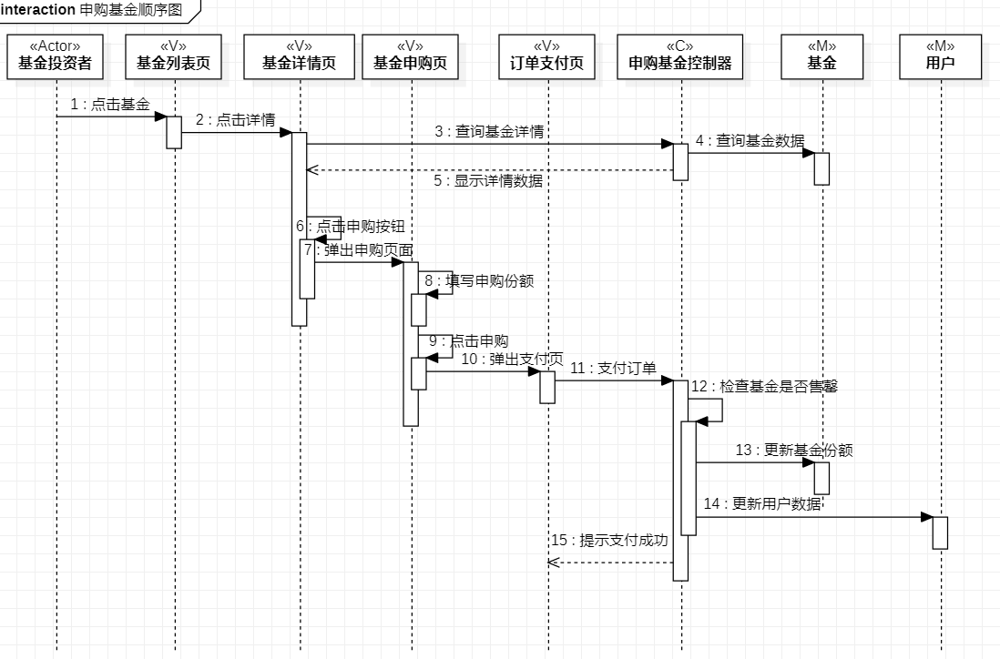
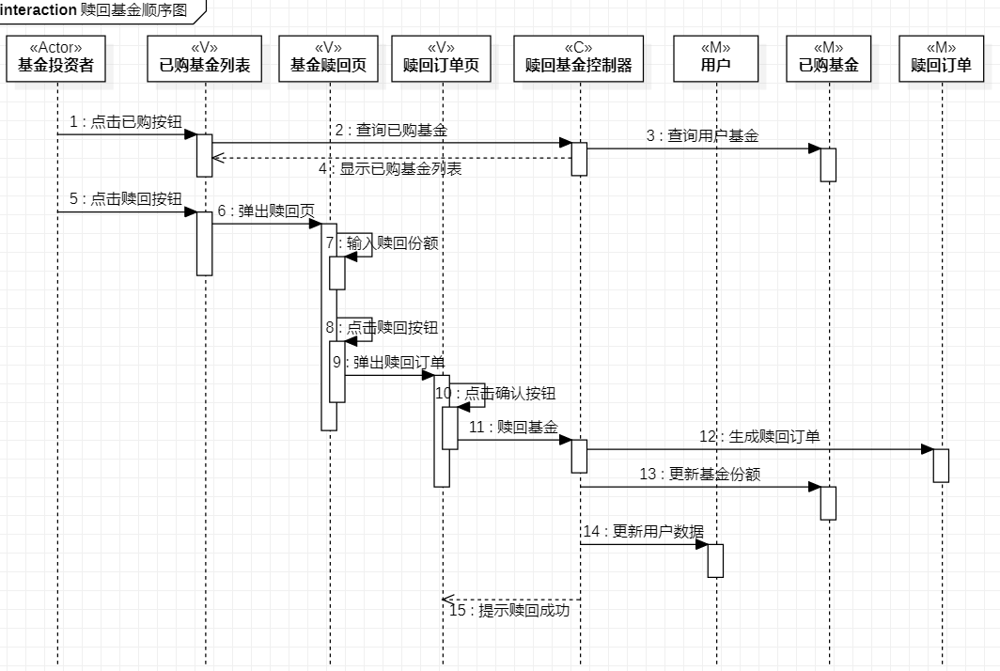

# 实验六：交互建模

## 一、实验目标
1、理解系统交互

2、掌握UML顺序图的画法

3、掌握对象交互的定义与建模方法

## 二、实验内容
1、确定系统顺序图

## 三、实验步骤
1、创建顺序图

2、画出用例图的1个参与者

3、画出类图的N个参与者

4、画出参与者之间的消息

## 四、实验结果
1、画图

图1：实验6-导入基金数据顺序图

图2：实验6-申购基金顺序图

图3：实验6-赎回基金类图